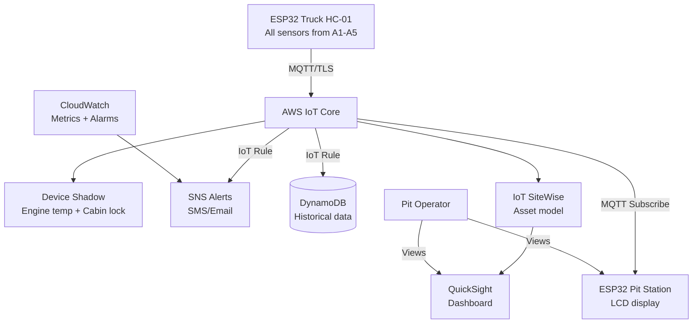

# Capstone: Full Integration Guide

**Weeks:** 15-18  
**Element:** ICTIOT502 All Elements + ICTIOT503 All Elements  
**Phase:** Capstone - Complete Fleet System

---

## Overview

The Capstone integrates all work from Weeks 1-14 into Assessment 6: **Integrated Fleet System + AWS Dashboard**. You'll create a complete RockCore Mining haul truck monitoring system with pit station, demonstrate fault scenarios, and produce comprehensive documentation mapping to every performance criterion.

## Capstone Objectives

By completion of Week 18, you will have:

- Two fully functional IoT devices (truck + pit station)
- AWS cloud integration with real-time dashboard
- Device Shadows for offline resilience
- Predictive maintenance alerts (CloudWatch + SNS)
- Comprehensive portfolio with evidence for all unit criteria
- 5-minute demo video showing 3+ real fault scenarios

---

## Assessment 6 Requirements

**Devices Required:**
1. **Haul Truck HC-01** (ESP32 from Weeks 1-9)
   - Engine compartment monitor (A1)
   - Cabin safety system (A2)
   - Vibration monitor (A3)
   - Payload system (A4)
   - Environmental sensors (A5)
   
2. **Pit Station** (Second ESP32 + LCD)
   - Receives fleet telemetry via MQTT
   - Displays live truck status
   - Operator alert interface

**AWS Components:**
- IoT Core: Thing registry, certificates, MQTT
- Device Shadows: Engine temp, cabin lock
- IoT Rules: Data routing to SNS, DynamoDB
- CloudWatch: Metrics, alarms, logs
- SiteWise: Asset modeling (optional but recommended)
- QuickSight: Fleet dashboard

**Documentation:**
- System architecture diagrams
- All code with comprehensive comments
- Test plans and results (3+ fault scenarios)
- Performance criteria mapping table
- Reflection on design decisions

---

## Week 15: Full Integration

### Focus Areas

**1. System Architecture**

Create complete architecture diagram showing all components and data flows:



**2. Integration Checklist**

- [ ] Truck publishes all sensor data to single topic: `rockcore/trucks/HC01/telemetry`
- [ ] Shadow updates for temperature and lock state
- [ ] IoT Rule routes temp > 70°C to SNS
- [ ] Pit station subscribes and displays truck status
- [ ] CloudWatch alarm for vibration anomaly count
- [ ] QuickSight dashboard shows live data
- [ ] All code unified in single Arduino sketch

**3. Unified Truck Code**

Combine all assessments into one cohesive system:

```cpp
// capstone_truck_complete.ino
// Integrates A1-A5 + AWS connectivity

#include <WiFiClientSecure.h>
#include <PubSubClient.h>
#include <ArduinoJson.h>
#include <DHT.h>
#include <MPU6050.h>
#include <MFRC522.h>
#include <Adafruit_SSD1306.h>
#include "secrets.h"

// All sensor pins from Weeks 1-9
#define DHTPIN 4
#define MQ2_PIN 34
#define FLAME_PIN 35
#define RAIN_PIN 36
#define LIGHT_PIN 39
// ... etc

// AWS topics
const char* TELEMETRY_TOPIC = "rockcore/trucks/HC01/telemetry";
const char* SHADOW_UPDATE = "$aws/things/rockcore-truck-HC01/shadow/update";

struct TruckState {
  float temperature;
  int gasLevel;
  float vibration;
  bool cabinLocked;
  int rainLevel;
  String status;  // "OPERATIONAL", "WARNING", "FAULT"
};

void publishTelemetry(TruckState state) {
  StaticJsonDocument<512> doc;
  doc["truck"] = "HC01";
  doc["temp"] = state.temperature;
  doc["gas"] = state.gasLevel;
  doc["vibe"] = state.vibration;
  doc["rain"] = state.rainLevel;
  doc["status"] = state.status;
  doc["timestamp"] = millis();
  
  char buffer[512];
  serializeJson(doc, buffer);
  client.publish(TELEMETRY_TOPIC, buffer);
}

void updateShadow(float temp, bool locked) {
  StaticJsonDocument<200> doc;
  JsonObject state = doc.createNestedObject("state");
  JsonObject reported = state.createNestedObject("reported");
  reported["temperature"] = temp;
  reported["cabin_locked"] = locked;
  
  char buffer[256];
  serializeJson(doc, buffer);
  client.publish(SHADOW_UPDATE, buffer);
}

void loop() {
  // Collect all sensor data
  TruckState state = collectAllSensors();
  
  // Publish to AWS
  publishTelemetry(state);
  updateShadow(state.temperature, state.cabinLocked);
  
  // Update local OLED
  displayOnOLED(state);
  
  // Check thresholds and trigger alerts
  checkFaultConditions(state);
  
  delay(5000);
}
```

**4. Testing Requirements**

Run complete system test documenting:
- Normal operation (all green)
- Temperature warning (60-80°C)
- Temperature fault (>80°C) → SNS alert received
- Vibration anomaly detection
- Unauthorized RFID attempt
- Rain detection triggering status change

---

## Deliverables for Week 15

1. Complete unified truck code
2. Architecture diagram (Mermaid or draw.io)
3. Integration test log with screenshots
4. Preliminary performance criteria mapping table

---

## Week 16-18 Tasks

See separate guides:
- [Pit Station Build](pit-station.md)
- [Testing Scenarios](testing.md)
- [Demo & Submission](demo.md)

---

**Navigation:** [← Week 14 (AWS)](../aws/14.md) | [Course Overview](../overview.md) | [Pit Station →](pit-station.md)
