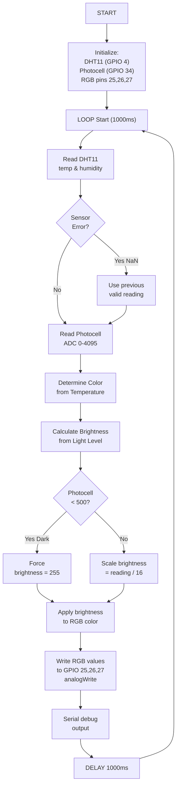
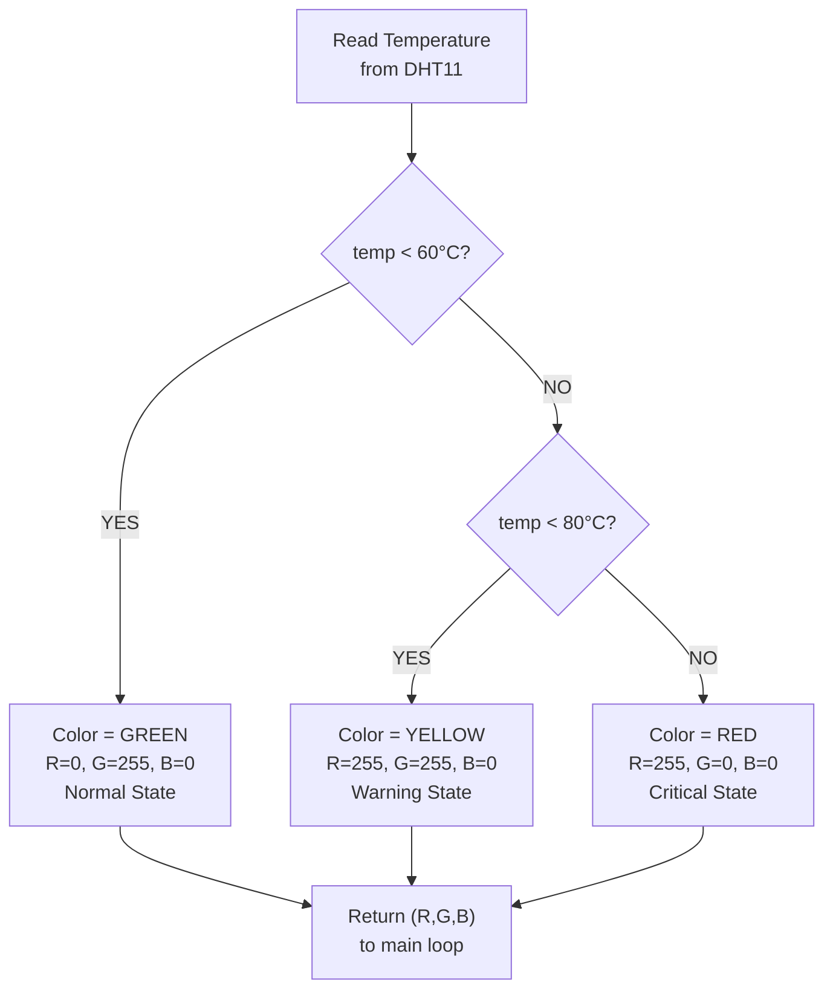
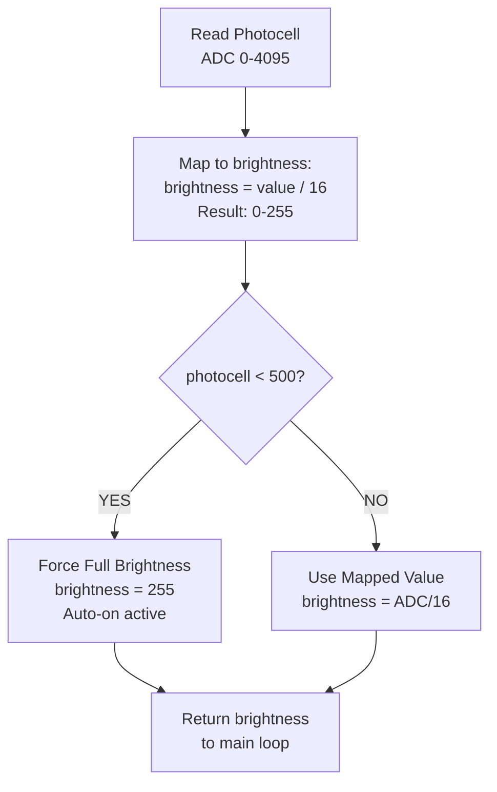
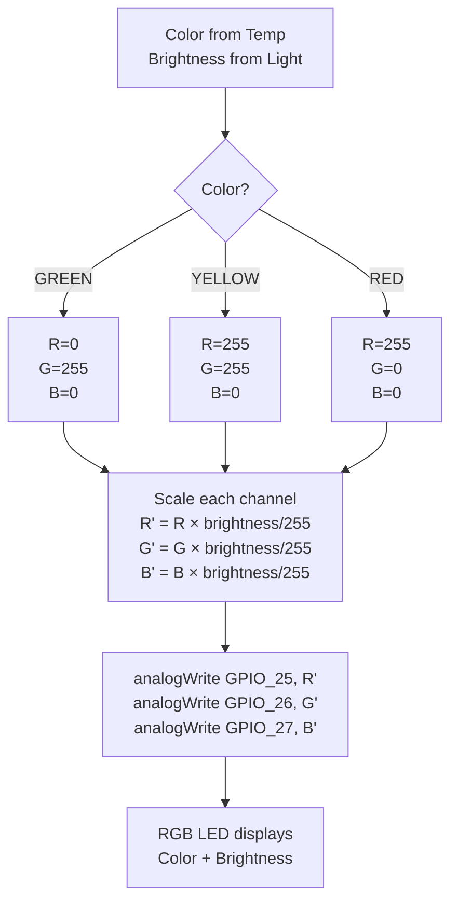

# Session 04: Analog Sensors & RGB Status Display

**Week:** 4  
**Element:** ICTIOT502 Element 2: Program IoT device  
**Duration:** 3.5 hours  
**Phase:** Electronics for Programmers

---

> **Note:** All electronics sessions can be completed using either Arduino (C++) or MicroPython on the ESP32. You may choose your preferred language for all programming tasks, code submissions, and portfolio checkpoints.

---

## Session Introduction

This week you transition from Wokwi simulation to **real ESP32 hardware** for the first time. You'll build the Engine Compartment Monitor using DHT11 (temperature/humidity), a photocell/LDR (ambient light), and an RGB LED for status display. This session completes **Assessment 1**, where you'll implement responsive color and brightness logic with automatic LED activation in darkness – critical skills for predictive maintenance and safety at RockCore Mining's dark engine bays.

## Learning Objectives

By the end of this session, you will be able to:

- Interface DHT11 temperature/humidity sensor with ESP32
- Read analog values from a photocell (LDR) to detect ambient light levels
- Control RGB LED brightness and color using PWM
- Map sensor data to visual status indicators (color = temperature, brightness = light level)
- Implement auto-on logic (activate LED when light falls below threshold)
- Complete **Assessment 1** with fault rectification documentation

---

## Session Structure

1. **Sensor Theory Review** – Analog vs digital sensors; photocell behavior
2. **Wokwi Simulation** – Test DHT11 + RGB LED code with simulated light levels
3. **Real ESP32 Build** – Physical wiring and component integration
4. **Color & Brightness Logic** – Map temperature to color, light level to brightness
5. **Assessment 1 Submission** – Portfolio evidence

---

## Pre-Session Preparation

!!! info "Required Reading"
    - PhysComp → [Analog Input](https://makeabilitylab.github.io/physcomp/arduino/analog-input.html)
    - DHT11 datasheet (see Resources page)
    - Photocell (LDR) behavior & calibration guide

!!! tip "Setup Check"
    - [ ] Keyestudio ESP32 kit collected (from instructor)
    - [ ] Wokwi project ready for pre-testing
    - [ ] Install DHT library in Arduino IDE: `DHT sensor library by Adafruit`
    - [ ] RGB LED and photocell sourced

---

## RockCore Mining Context

Engine compartment fires are a leading cause of heavy equipment loss in mining. Your **Engine Compartment Monitor** must visually indicate the engine's thermal state and respond to darkness by automatically enabling status lights. The system combines:

- **Temperature Status (via RGB color):**
  - Green: Normal (< 60°C)
  - Yellow: Warning (60–80°C)
  - Red: Critical (> 80°C)

- **Ambient Light Response (via RGB brightness):**
  - In darkness (photocell < 500): LED automatically activates at full brightness
  - In dim light (500–1500): LED at medium brightness
  - In normal/bright light (> 1500): LED brightness scales with available light

This design mimics a truck cabin where dark tunnels and night operations require automatic lighting that reflects both engine status and available light.

---

## Sensors & Components

### DHT11 Temperature/Humidity Sensor
- **Output:** I²C digital (single wire protocol)
- **Reading:** Temperature (°C), Humidity (%)
- **Range:** Temp 0–50°C (±2°C accuracy), Humidity 20–90% RH
- **Common Issue:** Returns `NaN` on faulty reading (poor connection, timing issue)
- **GPIO:** 4 (configurable)

### Photocell (LDR – Light Dependent Resistor)
- **Output:** Analog (0–4095 on ESP32 10-bit ADC)
- **Behavior:** Resistance decreases in light, increases in darkness
- **Readings:**
  - Bright sunlight: > 3000
  - Indoor light: 1500–2500
  - Dim/twilight: 500–1500
  - Darkness/night: < 500
- **GPIO:** 34 (ADC input, analog-only pin)

### RGB LED (Common Cathode)
- **Pins:** R (GPIO 25), G (GPIO 26), B (GPIO 27) – all PWM-capable
- **Control:** `analogWrite(pin, 0–255)` for brightness per channel
- **Resistors:** 220Ω per channel (limit current)

---

## Wiring Diagram

```
ESP32 Pin Layout for Engine Compartment Monitor
================================================

DHT11 Sensor:
  VCC → 3.3V
  GND → GND
  DATA → GPIO 4

Photocell (LDR with 10kΩ pull-down resistor):
  One leg → 3.3V
  Other leg → GPIO 34 (ADC)
  GPIO 34 → GND via 10kΩ resistor

RGB LED (Common Cathode):
  Red cathode   → 220Ω resistor → GPIO 25
  Green cathode → 220Ω resistor → GPIO 26
  Blue cathode  → 220Ω resistor → GPIO 27
  Common anode  → 5V (or 3.3V with current limiting)

Breadboard Layout:
  Top rail: 5V (from USB or external PSU)
  Second rail: 3.3V (from ESP32)
  Bottom rail: GND

Components positioned:
  - DHT11 on left side (I²C pull-ups if needed)
  - Photocell + 10k resistor in center (forms voltage divider)
  - RGB LED on right side (resistors in series)
```

---

## System Logic Overview

The Engine Compartment Monitor performs these steps every 1000ms:

1. **Read temperature** from DHT11 (handle errors gracefully)
2. **Read light level** from photocell ADC (0–4095)
3. **Determine color** based on temperature:
   - < 60°C → green
   - 60–80°C → yellow
   - ≥ 80°C → red
4. **Calculate brightness** from light level:
   - If photocell < 500: force full brightness (255)
   - Else: scale brightness proportionally (photocell / 16)
5. **Set RGB LED** to (color, brightness)
6. **Output debug info** to serial (for troubleshooting)

This ensures the LED always displays the engine's thermal state while adjusting visibility based on ambient light.

---

## Hands-On Tasks

### Task 1: DHT11 Temperature & Humidity Reading (Wokwi)

**Wokwi:** Add DHT22 sensor (DHT11 not available in Wokwi, but code is identical).

**Objective:** Read temperature and humidity, handle sensor errors (NaN).

**Pseudocode:**
```
PSEUDOCODE: DHT11 Temperature Reading
=====================================

1. SETUP:
   - Initialize DHT library with GPIO 4
   - Start serial communication (115200 baud)
   - Print welcome message

2. LOOP (every 2 seconds):
   a. READ temperature using dht.readTemperature()
   b. READ humidity using dht.readHumidity()
   c. CHECK if either value is NaN (sensor error):
      - IF NaN: print error message, skip processing, continue
      - IF valid: proceed to next step
   d. PRINT temp and humidity to serial
   e. DELAY 2000ms
```

**Implementation Hint (Sketch):**
```cpp
#include <DHT.h>

#define DHTPIN 4
#define DHTTYPE DHT11
DHT dht(DHTPIN, DHTTYPE);

void setup() {
  Serial.begin(115200);
  dht.begin();
  Serial.println("Engine Monitor: Starting...");
}

void loop() {
  float temp = dht.readTemperature();
  float humidity = dht.readHumidity();
  
  if (isnan(temp) || isnan(humidity)) {
    Serial.println("ERROR: DHT sensor read failed");
    return;
  }
  
  Serial.print("Temp: ");
  Serial.print(temp);
  Serial.print("°C | Humidity: ");
  Serial.print(humidity);
  Serial.println("%");
  
  delay(2000);
}
```

---

### Task 2: Photocell Analog Reading & Thresholding

**Wokwi:** Add potentiometer to simulate photocell light levels (0–4095).

**Objective:** Read analog light levels, determine brightness category.

**Pseudocode:**
```
PSEUDOCODE: Photocell Light Level Detection
=============================================

1. SETUP:
   - Configure GPIO 34 as analog input
   - Start serial

2. LOOP (every 1000ms):
   a. READ analog value from GPIO 34
      - Result: 0–4095 (10-bit ADC on ESP32)
   b. CLASSIFY light level:
      - IF value > 2500: "Bright"
      - ELSE IF value > 1500: "Normal"
      - ELSE IF value > 500: "Dim"
      - ELSE: "Dark"
   c. PRINT light reading and classification
   d. DELAY 1000ms
```

**Implementation Hint:**
```cpp
const int PHOTOCELL_PIN = 34;

void setup() {
  Serial.begin(115200);
  pinMode(PHOTOCELL_PIN, INPUT);
}

void loop() {
  int lightLevel = analogRead(PHOTOCELL_PIN);
  
  Serial.print("Light Level: ");
  Serial.print(lightLevel);
  Serial.print(" - ");
  
  if (lightLevel > 2500) {
    Serial.println("Bright");
  } else if (lightLevel > 1500) {
    Serial.println("Normal");
  } else if (lightLevel > 500) {
    Serial.println("Dim");
  } else {
    Serial.println("Dark");
  }
  
  delay(1000);
}
```

---

### Task 3: RGB LED PWM Control – Color & Brightness

**Objective:** Control RGB LED color and brightness using PWM.

**Pseudocode:**
```
PSEUDOCODE: RGB LED PWM Control
================================

1. SETUP:
   - Configure GPIO 25, 26, 27 as PWM outputs
   - Set PWM frequency (default OK)

2. LOOP:
   a. SET LED to a color:
      - GREEN: R=0, G=255, B=0
      - YELLOW: R=255, G=255, B=0
      - RED: R=255, G=0, B=0
   b. ADJUST brightness (0–255):
      - multiply each RGB value by (brightness / 255)
   c. WRITE to GPIO pins using analogWrite()
   d. DELAY to see color change

Example: Fade through colors
   - For each brightness level 0→255:
     - Set color to RED
     - Write R=brightness, G=0, B=0
     - Delay 10ms
```

**Implementation Hint:**
```cpp
#define RGB_R 25
#define RGB_G 26
#define RGB_B 27

void setup() {
  pinMode(RGB_R, OUTPUT);
  pinMode(RGB_G, OUTPUT);
  pinMode(RGB_B, OUTPUT);
}

void setRGB(int red, int green, int blue) {
  analogWrite(RGB_R, red);
  analogWrite(RGB_G, green);
  analogWrite(RGB_B, blue);
}

void loop() {
  // Green at full brightness
  setRGB(0, 255, 0);
  delay(1000);
  
  // Yellow at full brightness
  setRGB(255, 255, 0);
  delay(1000);
  
  // Red at full brightness
  setRGB(255, 0, 0);
  delay(1000);
  
  // Red at half brightness
  setRGB(127, 0, 0);
  delay(1000);
}
```

---

### Task 4: Temperature → Color Mapping

**Objective:** Read temperature, map to RGB color (green/yellow/red).

**Pseudocode:**
```
PSEUDOCODE: Temperature Color Determination
===========================================

1. READ temperature from DHT11
   - Handle NaN errors

2. DETERMINE color based on temp:
   - IF temp < 60°C:
       color = GREEN (R=0, G=255, B=0)
   - ELSE IF temp < 80°C:
       color = YELLOW (R=255, G=255, B=0)
   - ELSE:
       color = RED (R=255, G=0, B=0)

3. WRITE color to RGB LED
   - setRGB(R_value, G_value, B_value)

4. PRINT temp and color to serial
```

**Implementation Hint:**
```cpp
void getColorFromTemp(float temp, int &r, int &g, int &b) {
  if (temp < 60) {
    r = 0; g = 255; b = 0;   // Green
  } else if (temp < 80) {
    r = 255; g = 255; b = 0; // Yellow
  } else {
    r = 255; g = 0; b = 0;   // Red
  }
}

// In loop:
float temp = dht.readTemperature();
if (!isnan(temp)) {
  int r, g, b;
  getColorFromTemp(temp, r, g, b);
  setRGB(r, g, b);
  Serial.println(temp);
}
```

---

### Task 5: Photocell → Brightness Mapping & Auto-On Logic

**Objective:** Map photocell reading to LED brightness; auto-activate in darkness.

**Pseudocode:**
```
PSEUDOCODE: Brightness Calculation & Auto-On
==============================================

1. READ photocell value (0–4095)

2. CALCULATE brightness:
   a. MAP photocell to brightness range:
      - brightness = (photocell_reading / 4095) × 255
      - Result: 0–255
   
   b. CHECK auto-on threshold:
      - IF photocell < 500 (dark):
          force_brightness = 255 (always on)
      - ELSE:
          use_brightness = calculated brightness

3. APPLY brightness to RGB color:
   - Scale color values: R' = R × (brightness/255)
   - Scale G' = G × (brightness/255)
   - Scale B' = B × (brightness/255)
   - setRGB(R', G', B')

4. PRINT light level and brightness to serial
```

**Implementation Hint:**
```cpp
int calculateBrightness(int photocellReading) {
  int brightness = map(photocellReading, 0, 4095, 0, 255);
  
  if (photocellReading < 500) {
    brightness = 255;  // Force full brightness in darkness
  }
  
  return brightness;
}

// In loop:
int lightLevel = analogRead(PHOTOCELL_PIN);
int brightness = calculateBrightness(lightLevel);

// Scale color by brightness
int r_scaled = (r * brightness) / 255;
int g_scaled = (g * brightness) / 255;
int b_scaled = (b * brightness) / 255;

setRGB(r_scaled, g_scaled, b_scaled);
Serial.println(brightness);
```

---

## System Flowcharts

The following Mermaid diagrams illustrate the control logic for the Engine Compartment Monitor. Study these carefully before implementing code.

### Flowchart 1: Main Program Loop



### Flowchart 2: Temperature State Determination



### Flowchart 3: Photocell to Brightness Mapping



### Flowchart 4: RGB LED Update with Color & Brightness




## Check Your Knowledge

!!! question "Q1 – Photocell Calibration"
    Why might your photocell sensor give different readings in a classroom vs. outdoors in sunlight?
    ??? tip "Answer"
        Photocells respond to total light intensity. Indoor fluorescent/LED lights typically produce 300–500 lux, while outdoor direct sunlight produces 100,000+ lux. The sensor's resistance changes logarithmically with light, so the ADC reading varies significantly. Calibration thresholds (500, 1500, 2500) are environment-dependent and may need tuning for different locations.

!!! question "Q2 – PWM for RGB Control"
    Why use PWM (analogWrite) to control RGB LED brightness instead of reducing the 5V supply voltage?
    ??? tip "Answer"
        PWM rapidly switches the LED on/off at a high frequency (typically 1000 Hz), and the human eye perceives it as continuous with perceived brightness proportional to duty cycle. Reducing supply voltage would reduce brightness but also reduce color intensity unpredictably. PWM is more precise, efficient, and allows independent control of each RGB channel.

!!! question "Q3 – Auto-On Logic in Dark Environments"
    In a mining truck's dark engine bay, why is the photocell's auto-on threshold (< 500) important?
    ??? tip "Answer"
        In darkness (tunnels, night), a technician needs the RGB status LED visible without manually enabling it. The auto-on threshold ensures the LED always displays the engine's thermal state (color) at maximum brightness when ambient light is insufficient, providing critical safety feedback even in total darkness.

---

## Assessment 1 Submission (Due End of Week 4)

**Submit to GitHub + Blackboard:**

1. **Pseudocode Sketch:** `engine_bay_monitor.ino` with pseudocode structure and comments (NO complete working code)
2. **Wiring Diagram:** Fritzing export or hand-drawn schematic showing DHT11, photocell, and RGB LED connections
3. **System Flowcharts:** Mermaid diagrams (or hand-drawn) showing:
   - Main loop logic (read sensors → determine color → calculate brightness → update RGB)
   - Temperature state determination (< 60°C = green, 60–80°C = yellow, ≥ 80°C = red)
   - Photocell to brightness mapping (auto-on below threshold)
4. **Test Video** (2–3 minutes): Demonstrate:
   - Normal operation (temp reading + RGB color display)
   - Low-light auto-on test (cover photocell to trigger darkness, RGB activates)
   - Temperature range tests (heat DHT11, show color transitions: green → yellow → red)
   - Fault rectification (document at least one bug/issue you fixed, e.g., NaN handling, threshold tuning)
5. **Reflection Paragraph:** How will the photocell sensing capability extend to control OLED brightness and truck lights in future weeks?

**Submission Details:**
- Submit via GitHub in `A1-Electronics-Fundamentals/code/esp32-arduino/`
- Include link in Blackboard submission form
- Mapping: ICTIOT502 Element 2 – Program IoT device, test and rectify faults

---

**Navigation:** [← Week 3](03.md) | [Course Overview](../index.md) | [Week 5 →](05.md)
