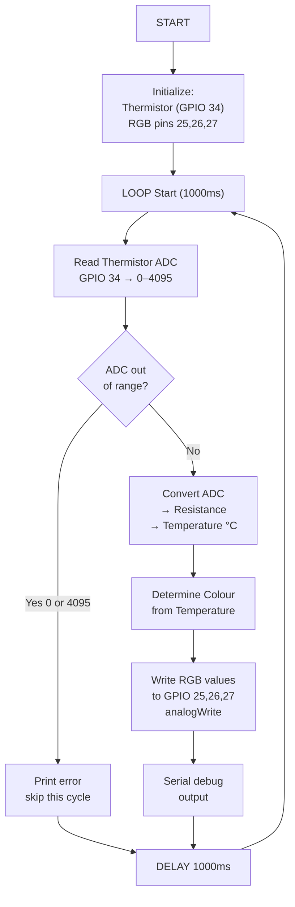

# Session 04: Thermistor Temperature Sensing & RGB Status Display

**Week:** 4  
**Element:** ICTIOT502 Element 2: Program IoT device  
**Duration:** 3.5 hours  
**Phase:** Electronics for Programmers

---

> **Note:** All electronics sessions can be completed using either Arduino (C++) or MicroPython on the ESP32. You may choose your preferred language for all programming tasks, code submissions, and portfolio checkpoints.

---

## Session Introduction

This week you transition from Wokwi simulation to **real ESP32 hardware** for the first time. You'll build the Engine Compartment Monitor using a thermistor (analog temperature sensor) and an RGB LED for colour-coded status display. This session completes **Assessment 1**, where you'll implement responsive colour logic tied to temperature thresholds – a critical skill for predictive maintenance and safety at RockCore Mining.

!!! note "Course Update"
    The original Session 4 design used a DHT11 sensor and a photocell. Due to hardware reliability issues with the DHT11 kits, we have switched to a **thermistor** for temperature reading. The photocell component has been removed from A1 scope. See the [Course Transition Log](../course-transition.md) for details.

## Learning Objectives

By the end of this session, you will be able to:

- Read analog temperature from a thermistor using ESP32 ADC
- Convert ADC values to temperature (°C) using the thermistor resistance formula
- Control RGB LED brightness and colour using PWM
- Map temperature readings to visual status indicators (colour = temperature state)
- Complete **Assessment 1** with fault rectification documentation

---

## Session Structure

1. **Sensor Theory Review** – Analog sensors; thermistor resistance behaviour
2. **Wokwi Simulation** – Test thermistor + RGB LED code with simulated temperature
3. **Real ESP32 Build** – Physical wiring and component integration
4. **Colour Logic** – Map temperature to colour (green/yellow/red)
5. **Assessment 1 Submission** – Portfolio evidence

---

## Pre-Session Preparation

!!! info "Required Reading"
    - PhysComp → [Analog Input](https://makeabilitylab.github.io/physcomp/arduino/analog-input.html)
    - NTC Thermistor datasheet (see Resources page)
    - Steinhart–Hart equation overview (Wikipedia or datasheet)

!!! tip "Setup Check"
    - [ ] Keyestudio ESP32 kit collected (from instructor)
    - [ ] Wokwi project ready for pre-testing
    - [ ] NTC 10kΩ thermistor and 10kΩ resistor sourced from kit
    - [ ] RGB LED sourced

---

## RockCore Mining Context

Engine compartment fires are a leading cause of heavy equipment loss in mining. Your **Engine Compartment Monitor** must visually indicate the engine's thermal state via a colour-coded RGB LED. The system reads temperature from a thermistor and maps it to:

- **Green:** Normal (< 60°C)
- **Yellow:** Warning (60–80°C)
- **Red:** Critical (> 80°C)

This design gives maintenance staff and operators an at-a-glance view of engine health without needing a screen or network connection.

---

## Sensors & Components

### Thermistor (NTC 10kΩ)
- **Type:** Negative Temperature Coefficient — resistance decreases as temperature rises
- **Output:** Analog voltage (read via ADC)
- **ADC range:** 0–4095 (12-bit on ESP32)
- **Circuit:** Voltage divider with 10kΩ fixed resistor
- **GPIO:** 34 (ADC input, analog-only pin)
- **Accuracy:** ±1–2°C with calibration, suitable for the 0–100°C monitoring range

### RGB LED (Common Cathode)
- **Pins:** R (GPIO 25), G (GPIO 26), B (GPIO 27) – all PWM-capable
- **Control:** `analogWrite(pin, 0–255)` for brightness per channel
- **Resistors:** 220Ω per channel (limit current)

---

## Wiring Diagram

```
ESP32 Pin Layout for Engine Compartment Monitor
================================================

Thermistor (NTC 10kΩ) with voltage divider:
  3.3V → [Thermistor] → GPIO 34 (ADC) → [10kΩ resistor] → GND

RGB LED (Common Cathode):
  Red cathode   → 220Ω resistor → GPIO 25
  Green cathode → 220Ω resistor → GPIO 26
  Blue cathode  → 220Ω resistor → GPIO 27
  Common anode  → 5V (or 3.3V with current limiting)

Breadboard Layout:
  Top rail: 5V (from USB or external PSU)
  Second rail: 3.3V (from ESP32)
  Bottom rail: GND

Components positioned:
  - Thermistor + 10kΩ resistor divider on left side
  - RGB LED on right side (resistors in series)
```

---

## System Logic Overview

The Engine Compartment Monitor performs these steps every 1000ms:

1. **Read thermistor ADC value** from GPIO 34 (0–4095)
2. **Convert ADC to resistance** using the voltage divider formula
3. **Convert resistance to temperature (°C)** using the Steinhart–Hart equation
4. **Determine colour** based on temperature:
   - < 60°C → green
   - 60–80°C → yellow
   - ≥ 80°C → red
5. **Set RGB LED** to the appropriate colour at full brightness
6. **Output debug info** to serial (ADC value, temperature, colour state)

---

## Hands-On Tasks

### Task 1: Thermistor Temperature Reading

**Wokwi:** Add a potentiometer to simulate the thermistor voltage divider output (0–3.3V on GPIO 34).

**Objective:** Read an analog voltage, convert to temperature, handle out-of-range values.

**Pseudocode:**
```
PSEUDOCODE: Thermistor Temperature Reading
==========================================

CONSTANTS:
  BETA = 3950          // B-constant for NTC 10kΩ
  R_FIXED = 10000      // 10kΩ fixed resistor
  NOMINAL_R = 10000    // thermistor resistance at 25°C
  NOMINAL_T = 298.15   // 25°C in Kelvin

1. SETUP:
   - Configure GPIO 34 as analog input
   - Start serial communication (115200 baud)
   - Print welcome message

2. LOOP (every 1000ms):
   a. READ ADC value from GPIO 34
      - Result: 0–4095 (12-bit ADC on ESP32)
   b. GUARD against ADC extremes (0 or 4095 = wiring fault):
      - IF adcVal == 0 OR adcVal == 4095: print error, skip
   c. CALCULATE thermistor resistance:
      - resistance = R_FIXED × adcVal / (4095 – adcVal)
   d. CALCULATE temperature in Kelvin (Steinhart–Hart simplified):
      - tempK = 1 / (1/NOMINAL_T + (1/BETA) × ln(resistance / NOMINAL_R))
   e. CONVERT to Celsius: temp = tempK – 273.15
   f. PRINT ADC value and temperature to serial
   g. DELAY 1000ms
```

**Implementation Hint (Sketch):**
```cpp
#include <math.h>

const int  THERM_PIN  = 34;
const float BETA       = 3950.0;
const float R_FIXED    = 10000.0;
const float NOMINAL_R  = 10000.0;
const float NOMINAL_T  = 298.15;   // 25°C in Kelvin

float readThermistorTemp() {
  int adcVal = analogRead(THERM_PIN);

  // Guard against open/short circuit
  if (adcVal == 0 || adcVal == 4095) {
    Serial.println("ERROR: Thermistor read out of range");
    return -999;
  }

  float resistance = R_FIXED * adcVal / (4095.0 - adcVal);
  float tempK = 1.0 / (1.0 / NOMINAL_T + (1.0 / BETA) * log(resistance / NOMINAL_R));
  return tempK - 273.15;
}

void setup() {
  Serial.begin(115200);
  Serial.println("Engine Monitor: Starting...");
}

void loop() {
  float temp = readThermistorTemp();
  if (temp != -999) {
    Serial.print("Temp: ");
    Serial.print(temp);
    Serial.println("°C");
  }
  delay(1000);
}
```

---

### Task 3: RGB LED PWM Control – Color & Brightness

**Objective:** Control RGB LED color and brightness using PWM.

**Pseudocode:**
```
PSEUDOCODE: RGB LED PWM Control
================================

1. SETUP:
   - Configure GPIO 25, 26, 27 as PWM outputs
   - Set PWM frequency (default OK)

2. LOOP:
   a. SET LED to a color:
      - GREEN: R=0, G=255, B=0
      - YELLOW: R=255, G=255, B=0
      - RED: R=255, G=0, B=0
   b. ADJUST brightness (0–255):
      - multiply each RGB value by (brightness / 255)
   c. WRITE to GPIO pins using analogWrite()
   d. DELAY to see color change

Example: Fade through colors
   - For each brightness level 0→255:
     - Set color to RED
     - Write R=brightness, G=0, B=0
     - Delay 10ms
```

**Implementation Hint:**
```cpp
#define RGB_R 25
#define RGB_G 26
#define RGB_B 27

void setup() {
  pinMode(RGB_R, OUTPUT);
  pinMode(RGB_G, OUTPUT);
  pinMode(RGB_B, OUTPUT);
}

void setRGB(int red, int green, int blue) {
  analogWrite(RGB_R, red);
  analogWrite(RGB_G, green);
  analogWrite(RGB_B, blue);
}

void loop() {
  // Green at full brightness
  setRGB(0, 255, 0);
  delay(1000);
  
  // Yellow at full brightness
  setRGB(255, 255, 0);
  delay(1000);
  
  // Red at full brightness
  setRGB(255, 0, 0);
  delay(1000);
  
  // Red at half brightness
  setRGB(127, 0, 0);
  delay(1000);
}
```

---

### Task 4: Temperature → Colour Mapping

**Objective:** Read temperature from thermistor, map to RGB colour (green/yellow/red).

**Pseudocode:**
```
PSEUDOCODE: Temperature Colour Determination
===========================================

1. READ temperature from thermistor (using readThermistorTemp())
   - Handle out-of-range errors (-999 return value)

2. DETERMINE colour based on temp:
   - IF temp < 60°C:
       colour = GREEN (R=0, G=255, B=0)
   - ELSE IF temp < 80°C:
       colour = YELLOW (R=255, G=255, B=0)
   - ELSE:
       colour = RED (R=255, G=0, B=0)

3. WRITE colour to RGB LED
   - setRGB(R_value, G_value, B_value)

4. PRINT temp and colour state to serial
```

**Implementation Hint:**
```cpp
void getColorFromTemp(float temp, int &r, int &g, int &b) {
  if (temp < 60) {
    r = 0; g = 255; b = 0;   // Green
  } else if (temp < 80) {
    r = 255; g = 255; b = 0; // Yellow
  } else {
    r = 255; g = 0; b = 0;   // Red
  }
}

// In loop:
float temp = readThermistorTemp();
if (temp != -999) {
  int r, g, b;
  getColorFromTemp(temp, r, g, b);
  setRGB(r, g, b);
  Serial.println(temp);
}
```

---

## System Flowcharts

The following Mermaid diagrams illustrate the control logic for the Engine Compartment Monitor. Study these carefully before implementing code.

### Flowchart 1: Main Program Loop



### Flowchart 2: Temperature State Determination


## Check Your Knowledge

!!! question "Q1 – Thermistor vs DHT11"
    Why is a thermistor a simpler choice than a DHT11 for analog temperature sensing in this application?
    ??? tip "Answer"
        A thermistor is a passive resistive component — it requires no library, no digital protocol, and no timing-sensitive communication. It's read with a single `analogRead()` call via a voltage divider. DHT11 uses a proprietary one-wire digital protocol that can fail with timing issues, poor wiring, or library incompatibilities. For a simple threshold-based temperature monitor, the thermistor is more robust.

!!! question "Q2 – PWM for RGB Control"
    Why use PWM (analogWrite) to control RGB LED brightness instead of reducing the 5V supply voltage?
    ??? tip "Answer"
        PWM rapidly switches the LED on/off at a high frequency (typically 1000 Hz), and the human eye perceives it as continuous with perceived brightness proportional to duty cycle. Reducing supply voltage would reduce brightness but also reduce color intensity unpredictably. PWM is more precise, efficient, and allows independent control of each RGB channel.

!!! question "Q3 – Temperature Thresholds in a Mining Context"
    Why are the warning thresholds set at 60°C and 80°C rather than, say, 40°C and 70°C?
    ??? tip "Answer"
        Mining haul truck engines operate at high ambient temperatures — the engine bay can routinely reach 40–55°C under normal load. Setting warnings at 60°C and 80°C avoids false positives during normal operation while still providing early warning before reaching critical temperatures (typically 90–100°C for engine coolant). Thresholds should be calibrated to the specific engine model's operating specifications.

---

## Assessment 1 Submission (Due End of Week 4)

**Submit to GitHub + Blackboard:**

1. **Pseudocode Sketch:** `engine_bay_monitor.ino` with pseudocode structure and comments (NO complete working code)
2. **Wiring Diagram:** Fritzing export or hand-drawn schematic showing thermistor voltage divider and RGB LED connections
3. **System Flowcharts:** Mermaid diagrams (or hand-drawn) showing:
   - Main loop logic (read thermistor → convert to temp → determine colour → update RGB)
   - Temperature state determination (< 60°C = green, 60–80°C = yellow, ≥ 80°C = red)
4. **Test Video** (2–3 minutes): Demonstrate:
   - Normal operation (temperature reading + RGB colour display via serial output)
   - Temperature range tests (warm the thermistor — e.g., pinch with fingers or warm air — show colour transitions: green → yellow → red)
   - Fault rectification (document at least one bug/issue you fixed, e.g., out-of-range ADC handling, threshold tuning)
5. **Reflection Paragraph:** How would you extend this system to log temperature over time or send alerts to a pit station? What role does the thermistor play in a larger IoT architecture?

**Submission Details:**
- Submit via GitHub in `A1-Electronics-Fundamentals/code/esp32-arduino/`
- Include link in Blackboard submission form
- Mapping: ICTIOT502 Element 2 – Program IoT device, test and rectify faults

---

**Navigation:** [← Week 3](03.md) | [Course Overview](../index.md) | [Week 5 →](week5-transition.md)
