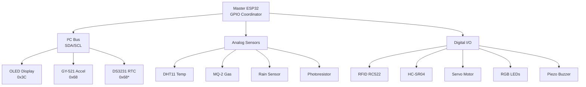

# Session 09: Full Truck Assembly

**Week:** 9  
**Element:** ICTIOT502 All Elements | ICTIOT503 Element 4: Test connectivity  
**Duration:** 3.5 hours  
**Phase:** Electronics for Programmers (Final Integration)

---

> **Note:** All electronics sessions can be completed using either Arduino (C++) or MicroPython on the ESP32. You may choose your preferred language for all programming tasks, code submissions, and portfolio checkpoints.

---

## Session Introduction

This is the **final electronics session** – you'll integrate all five panels into one complete haul truck system. You'll implement inter-panel I²C communication, comprehensive fault testing, and finalize **Assessments 4 & 5**. By the end of today, your truck will be a fully functional standalone system ready for AWS cloud connectivity in Week 10.

## Learning Objectives

By the end of this session, you will be able to:

- Integrate multi-panel sensor networks using shared I²C bus
- Implement system-wide fault detection and recovery
- Test complete truck system under simulated failure scenarios
- Finalize Assessments 4 & 5 documentation
- Prepare truck for AWS IoT Core integration

---

## Session Structure

1. **System Integration** – Connect all five panels
2. **Master Controller** – Central ESP32 coordination
3. **Fault Testing** – Simulate real-world failures
4. **Assessment 4 & 5 Completion** – Final submissions
5. **AWS Preparation** – MQTT readiness check

---

## Pre-Session Preparation

!!! info "Required Completion"
    - All panels physically built (front, back, left, right, roof, base)
    - Assessments 1-3 submitted
    - 3D printed chassis fully assembled

!!! tip "Setup Check"
    - [ ] All ESP32 modules programmed and tested individually
    - [ ] I²C addressing documented (OLED, GY-521, RTC)
    - [ ] Power distribution plan (one 5V supply, multiple 3.3V regulators)
    - [ ] GitHub repo organized with folders for each assessment

---

## RockCore Mining Context

Your truck now has:
- **Front panel**: RGB status indicator (Assessment 1 support)
- **Engine compartment**: DHT11, MQ-2, flame sensor (Assessment 1)
- **Cabin (left panel)**: RFID, RTC, touch (Assessment 2)
- **Base panel**: OLED, GY-521 vibration (Assessment 3)
- **Back panel**: Servo dump bed (Assessment 4)
- **Roof panel**: Rain, light, ultrasonic, buzzer (Assessment 5)

Today you'll make them work together as one fleet-ready vehicle.

---

## System Architecture



!!! warning "I²C Address Conflict"
    GY-521 and DS3231 both default to 0x68. Options:
    1. Use separate I²C buses (ESP32 has two: Wire and Wire1)
    2. Change DS3231 address (requires hardware mod)
    3. Disable one temporarily for testing

---

## Hands-On Tasks

### Task 1: Master Controller - Data Aggregation

```cpp
// Week 9 Task 1 - Master Controller
#include <Wire.h>
#include <DHT.h>
#include <MPU6050.h>
#include <Adafruit_SSD1306.h>

#define DHTPIN 4
DHT dht(DHTPIN, DHT11);
MPU6050 mpu;
Adafruit_SSD1306 display(128, 64, &Wire, -1);

struct TruckData {
  float temperature;
  int gasLevel;
  float vibration;
  int rainLevel;
  int lightLevel;
  float distance;
  bool accessGranted;
  String status;
};

TruckData truck;

void setup() {
  Serial.begin(115200);
  Wire.begin();
  dht.begin();
  mpu.begin(MPU6050_SCALE_2000DPS, MPU6050_RANGE_2G);
  display.begin(SSD1306_SWITCHCAPVCC, 0x3C);
  
  Serial.println("=== RockCore Fleet Truck HC-01 ===");
  truck.status = "INITIALIZING";
}

void updateSensors() {
  truck.temperature = dht.readTemperature();
  truck.gasLevel = analogRead(34);  // MQ-2
  
  Vector accel = mpu.readNormalizeAccel();
  truck.vibration = sqrt(accel.XAxis * accel.XAxis + 
                         accel.YAxis * accel.YAxis + 
                         accel.ZAxis * accel.ZAxis);
  
  truck.rainLevel = analogRead(35);
  truck.lightLevel = analogRead(36);
  
  // Update status based on all sensors
  if (truck.temperature > 80 || truck.gasLevel > 300) {
    truck.status = "FAULT";
  } else if (truck.temperature > 60 || truck.vibration > 1.5) {
    truck.status = "WARNING";
  } else {
    truck.status = "OPERATIONAL";
  }
}

void updateDisplay() {
  display.clearDisplay();
  display.setCursor(0,0);
  display.setTextSize(1);
  display.print("Truck: HC-01");
  display.println(truck.status);
  display.println("----------------");
  display.print("Temp: ");
  display.print(truck.temperature, 1);
  display.println("C");
  display.print("Gas: ");
  display.println(truck.gasLevel);
  display.print("Vibe: ");
  display.println(truck.vibration, 2);
  display.print("Rain: ");
  display.println(truck.rainLevel < 2000 ? "YES" : "NO");
  display.display();
}

void loop() {
  updateSensors();
  updateDisplay();
  
  // Serial logging (JSON format for AWS later)
  Serial.print("{\"truck\":\"HC-01\",\"temp\":");
  Serial.print(truck.temperature);
  Serial.print(",\"gas\":");
  Serial.print(truck.gasLevel);
  Serial.print(",\"vibe\":");
  Serial.print(truck.vibration, 3);
  Serial.print(",\"status\":\"");
  Serial.print(truck.status);
  Serial.println("\"}");
  
  delay(2000);
}
```

### Task 2: Fault Injection Testing

**Test Scenarios:**

1. **Engine Overheat**: Heat DHT11 above 80°C
2. **Gas Leak**: Blow on MQ-2 sensor
3. **Tire Imbalance**: Shake base panel (GY-521)
4. **Rain Storm**: Drop water on rain sensor
5. **Collision Warning**: Wave hand in front of ultrasonic
6. **Unauthorized Access**: Use unregistered RFID card

```cpp
// Week 9 Task 2 - Fault Testing Code
// Add to master controller loop()

void testFaultConditions() {
  // Check for critical faults
  bool criticalFault = false;
  String faultMessage = "";
  
  if (isnan(truck.temperature)) {
    criticalFault = true;
    faultMessage = "SENSOR FAULT: DHT11 disconnected";
  }
  
  if (truck.temperature > 80) {
    criticalFault = true;
    faultMessage = "CRITICAL: Engine overheat";
  }
  
  if (truck.gasLevel > 500) {
    criticalFault = true;
    faultMessage = "CRITICAL: Gas leak detected";
  }
  
  if (truck.vibration > 2.0) {
    criticalFault = true;
    faultMessage = "CRITICAL: Severe vibration";
  }
  
  if (criticalFault) {
    digitalWrite(RED_LED, HIGH);
    tone(BUZZER, 2000, 1000);
    Serial.print("FAULT: ");
    Serial.println(faultMessage);
    truck.status = "SHUTDOWN";
  }
}
```

### Task 3: System Recovery & Graceful Degradation

```cpp
// Week 9 Task 3 - Fault Recovery
void checkSensorHealth() {
  // DHT11 health check
  if (isnan(truck.temperature)) {
    Serial.println("WARNING: DHT11 offline - using last known value");
    // Use cached value or safe default
  }
  
  // I²C device health check
  Wire.beginTransmission(0x3C);  // OLED
  if (Wire.endTransmission() != 0) {
    Serial.println("WARNING: OLED offline - continuing without display");
  }
  
  Wire.beginTransmission(0x68);  // GY-521
  if (Wire.endTransmission() != 0) {
    Serial.println("WARNING: GY-521 offline - vibration monitoring disabled");
    truck.vibration = 0;  // Safe default
  }
}

// Add to loop()
void loop() {
  checkSensorHealth();
  updateSensors();
  testFaultConditions();
  updateDisplay();
  delay(2000);
}
```

---

## Check Your Knowledge

!!! question "Q1 – I²C Bus Load"
    Your system has 3 I²C devices (OLED, GY-521, RTC). What's the maximum you can add?
    ??? tip "Answer"
        I²C supports 127 devices (7-bit addressing), but practical limit is ~10-20 due to capacitance and speed degradation. Each device adds capacitance to SDA/SCL lines.

!!! question "Q2 – System-Level Fault"
    If the master ESP32 crashes, what happens to all subsystems?
    ??? tip "Answer"
        Complete system failure – single point of failure. Industrial systems use redundant controllers or watchdog timers that reset the ESP32 on hang.

!!! question "Q3 – Power Budget"
    Calculate total current draw: ESP32 (250mA) + OLED (20mA) + 3 sensors (50mA each) + servo (500mA). Can you power this from USB (500mA)?
    ??? tip "Answer"
        Total = 920mA. USB can't supply this safely. Need external 5V power supply (2A minimum) or separate servo power.

---

## Assessment 4 Finalization: Payload & Load Management

**Due:** End of Week 9

**Final deliverables:**
1. Servo motor control code with smooth dump bed operation
2. Water level sensor integration (if using weight simulation)
3. **Design evaluation document**:
   - Servo vs stepper comparison table
   - Power management strategy for fleet deployment
   - Scalability analysis (cost per truck, maintenance needs)
4. Test video showing dump cycle with load monitoring

**Mapping:** ICTIOT503 Element 2 – Evaluate design options and resources, assess scalability.

---

## Assessment 5 Finalization: Haul Road Environmental Monitor

**Due:** End of Week 9

**Final deliverables:**
1. Complete roof panel code (rain, light, ultrasonic, buzzer)
2. **Connectivity test report**:
   - Tested under simulated dust interference
   - Vibration testing (shake test)
   - Power consumption measurements
   - GPIO usage map showing all pin assignments
3. Fleet compatibility matrix (can 20 trucks use identical hardware?)
4. Failure modes and effects analysis (FMEA)

**Mapping:** ICTIOT503 Element 4 – Test connectivity and compatibility.

---

## Next Week Preview: AWS IoT Core

**Week 10** – You'll connect this truck to AWS IoT Core using MQTT:
- Register truck as IoT Thing
- Publish sensor data to AWS cloud
- Implement secure X.509 certificate authentication
- View real-time data in AWS console

**Homework:** Complete AWS Skill Builder course "Getting Started with AWS IoT" (35 minutes).

---

## Portfolio Checkpoint

**Save to GitHub:**

1. Master controller code with all sensor integration
2. **System integration video** (5-7 minutes):
   - Show all panels powered on
   - Demonstrate OLED displaying data from all sensors
   - Trigger 3+ fault scenarios with visible/audio alerts
   - Show system recovery from non-critical fault
3. **Wiring documentation**: Complete system diagram (Fritzing or hand-drawn)
4. **Power budget spreadsheet**: Calculate current draw for each component
5. **Fault test log**: Document results of all 6 test scenarios

---

**Navigation:** [← Week 8](08.md) | [Course Overview](../overview.md) | [Week 10 (AWS) →](../aws/10.md)
