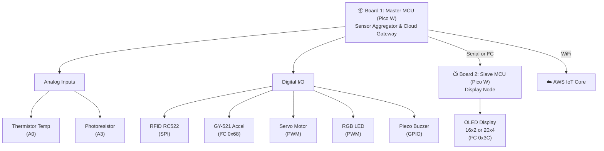
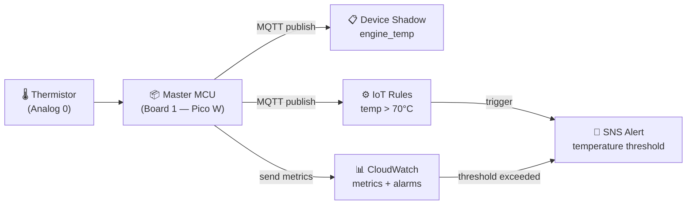
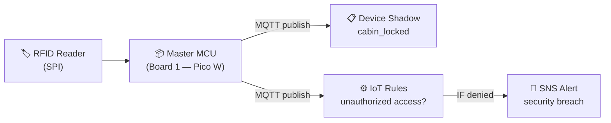
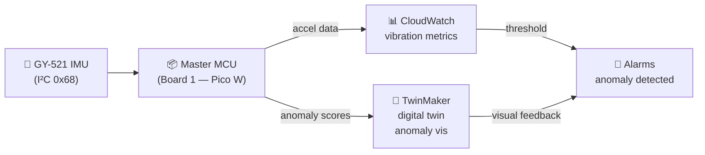
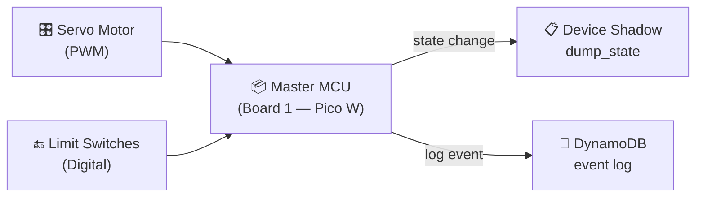
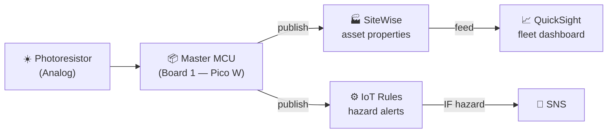
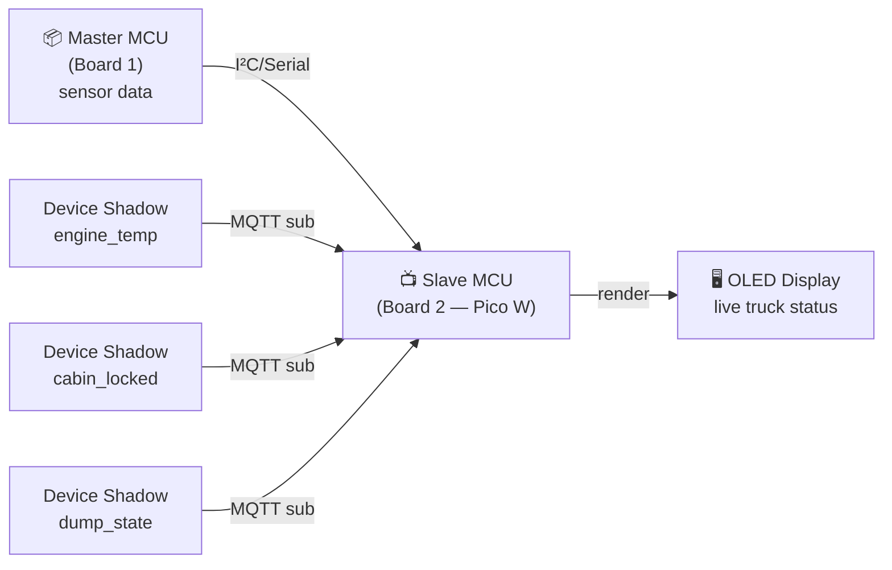

# Session 09: Full Truck Assembly

**Week:** 9  
**Element:** ICTIOT502 All Elements | ICTIOT503 Element 4: Test connectivity  
**Duration:** 3.5 hours  
**Phase:** Electronics for Programmers (Final Integration)

---

> **Note:** All electronics sessions use the **Raspberry Pi Pico W** running the **Arduino framework** (C++). Code submissions and portfolio checkpoints should be written in Arduino C++.

---

## Session Introduction

This is the **final electronics session** – you'll integrate all five panels into one complete haul truck system. You'll implement inter-panel I²C communication, comprehensive fault testing, and finalize **Assessments 4 & 5**. By the end of today, your truck will be a fully functional standalone system ready for the AWS IoT phase.

!!! danger "⚠️ No Class for Three Weeks After Today"
    **Week 10 is a public holiday — there is no class.**
    A term break immediately follows, so the next session is:

    ## 🗓️ AWS Week 10 — Monday 20 April 2026

    Use the break to catch up on any outstanding A1–A5 submissions and ensure your Pico W is publishing sensor readings reliably.

!!! info "3D Printed Truck Chassis — Optional"
    Mounting your components onto the 3D printed truck chassis is **optional**. Your breadboard setup is fully accepted as the final capstone concept — you will not be penalised for not mounting to the chassis. If you do want to mount up, the AWS weeks are the best time to do it since sessions focus on cloud configuration rather than hardware wiring.

## Learning Objectives

By the end of this session, you will be able to:

- Integrate multi-panel sensor networks using shared I²C bus
- Implement system-wide fault detection and recovery
- Test complete truck system under simulated failure scenarios
- Finalize Assessments 4 & 5 documentation
- Prepare truck for AWS IoT Core integration

---

## Session Structure

1. **Truck & Display Architecture** – Two Pico W boards with inter-board communication
2. **Truck Controller** – Sensor aggregation and filtering
3. **Display Controller** – OLED rendering of live truck data
4. **Fault Testing** – Simulate real-world failures and recovery
5. **Assessment 4 & 5 Completion** – Final submissions
6. **AWS Preparation** – MQTT readiness check for Board 1

---

## Pre-Session Preparation

!!! info "Required Completion"
    - All panels physically built (front, back, left, right, roof, base)
    - Assessments 1-3 submitted
    - 3D printed chassis fully assembled

!!! tip "Setup Check"
    - [ ] **2 Pico W boards** ordered/available (Board 1 = Truck, Board 2 = Display) and programmed individually
    - [ ] Inter-board communication plan documented (I²C if co-located, serial if separate)
    - [ ] I²C addressing documented on Board 1 (GY-521 at 0x68)
    - [ ] Power distribution plan (one 5V supply per board, 3.3V regulators as needed)
    - [ ] GitHub repo organized with folders for each assessment + inter-board comms code

---

## MCU Roles in This Session

!!! info "Two Pico W Boards: Truck MCU + Display MCU"
    Session 9 requires **2 Pico W boards** because the OLED display and GY-521 vibration sensor cannot run on the same board.

    **Architecture:**
    - **Board 1 (Master MCU):** Runs all truck sensors (thermistor, RFID, servo, RGB, buzzer, **GY-521**). Publishes sensor data to AWS IoT Core and to Board 2 via inter-board communication.
    - **Board 2 (Slave MCU):** Runs the **OLED display**. Receives sensor data from Board 1 via I²C or serial communication and displays live truck status.

    **What this means practically:**

    - Inter-board communication: Configure I²C (if boards are close) or serial (UART via USB bridge if separate). Master (Board 1) sends sensor readings; Slave (Board 2) displays them on the OLED.
    - The filtering algorithm you wrote in Session 8 runs on Master (Board 1). Slave (Board 2) is a pure display client.
    - Both boards run the Arduino framework (C++) with identical build toolchain.

---

Your truck has (on **Board 1 — Truck MCU**):
- **Front panel**: RGB status indicator (Assessment 1 support)
- **Engine compartment**: Thermistor (NTC 10kΩ) (Assessment 1)
- **Cabin (left panel)**: RFID (Assessment 2)
- **Base panel**: GY-521 vibration (Assessment 3) + servo (Assessment 4)
- **Roof panel**: Photoresistor, buzzer (Assessment 5)

Your display runs on (**Board 2 — Slave MCU**):
- **OLED (16×2 or 20×4)**: Shows live truck readings from Board 1 (Master)

---

## System Architecture


```mermaid
graph TB
    Board1["📦 Board 1: Master MCU (Pico W)<br/>Sensor Aggregator & Cloud Gateway"] 
    Board2["📺 Board 2: Slave MCU (Pico W)<br/>Display Node"]
    
    Board1 --> Analog[Analog Inputs]
    Analog --> Thermistor["Thermistor Temp<br/>(A0)"]
    Analog --> Light["Photoresistor<br/>(A3)"]
    
    Board1 --> Digital[Digital I/O]
    Digital --> RFID["RFID RC522<br/>(SPI)"]
    Digital --> GY521["GY-521 Accel<br/>(I²C 0x68)"]
    Digital --> Servo["Servo Motor<br/>(PWM)"]
    Digital --> RGB["RGB LED<br/>(PWM)"]
    Digital --> Buzzer["Piezo Buzzer<br/>(GPIO)"]
    
    Board1 -->|Serial or I²C| Board2
    Board2 --> OLED["OLED Display<br/>16x2 or 20x4<br/>(I²C 0x3C)"]
    
    Board1 -->|WiFi| AWS["☁️ AWS IoT Core"]
```

---

## Assessment-to-AWS Mapping Overview

Each assessment (A1–A5) you completed in Sessions 1–9 directly feeds into AWS services during Weeks 10–18. Here's the map:

| Assessment | Truck Panel | Key Sensors | Primary AWS Services |
|---|---|---|---|
| **A1: Engine Monitor** | Front | Thermistor | Device Shadow, CloudWatch, SNS alerts |
| **A2: Access Control** | Left | RFID reader | Device Shadow, IoT Rules, SNS alerts |
| **A3: Vibration Monitor** | Base | GY-521 IMU (accelerometer) | CloudWatch alarms, TwinMaker digital twin |
| **A4: Payload Management** | Back | Servo motor state, limit switches | Device Shadow, DynamoDB (logging) |
| **A5: Environmental** | Roof | Photoresistor | SiteWise, QuickSight dashboards |
| **Slave MCU Display** | Board 2 (separate Pico W) | OLED | Consumes Master sensor data + AWS Shadows |

---

## A1: Engine Monitor → AWS Integration


```mermaid
graph LR
    Thermistor["🌡️ Thermistor<br/>(Analog 0)"]
    
    Board1["📦 Master MCU<br/>(Board 1 — Pico W)"]
    
    Shadow["📋 Device Shadow<br/>engine_temp"]
    Rules["⚙️ IoT Rules<br/>temp > 70°C"]
    CW["📊 CloudWatch<br/>metrics + alarms"]
    SNS["📧 SNS Alert<br/>temperature threshold"]
    
    Thermistor --> Board1
    
    Board1 -->|MQTT publish| Shadow
    Board1 -->|MQTT publish| Rules
    Board1 -->|send metrics| CW
    
    Rules -->|trigger| SNS
    CW -->|threshold exceeded| SNS
```

**What you'll learn:** Publish sensor data to AWS IoT Core, update Device Shadow, create rules to trigger alerts.

---

## A2: Access Control → AWS Integration


```mermaid
graph LR
    RFID["🏷️ RFID Reader<br/>(SPI)"]
    
    Board1["📦 Master MCU<br/>(Board 1 — Pico W)"]
    
    Shadow["📋 Device Shadow<br/>cabin_locked"]
    Rules["⚙️ IoT Rules<br/>unauthorized access?"]
    SNS["📧 SNS Alert<br/>security breach"]
    
    RFID --> Board1
    
    Board1 -->|MQTT publish| Shadow
    Board1 -->|MQTT publish| Rules
    
    Rules -->|IF denied| SNS
```

**What you'll learn:** Track authentication state in Device Shadow, trigger security alerts via IoT Rules.

---

## A3: Vibration Monitor → AWS Integration


```mermaid
graph LR
    IMU["📐 GY-521 IMU<br/>(I²C 0x68)"]
    
    Board1["📦 Master MCU<br/>(Board 1 — Pico W)"]
    
    CW["📊 CloudWatch<br/>vibration metrics"]
    TM["🎨 TwinMaker<br/>digital twin<br/>anomaly vis"]
    Alarm["🔔 Alarms<br/>anomaly detected"]
    
    IMU --> Board1
    
    Board1 -->|accel data| CW
    Board1 -->|anomaly scores| TM
    
    CW -->|threshold| Alarm
    TM -->|visual feedback| Alarm
```

**What you'll learn:** Stream accelerometer data, create anomaly detection rules, visualize with TwinMaker digital twin.

---

## A4: Payload Management → AWS Integration


```mermaid
graph LR
    Servo["🎛️ Servo Motor<br/>(PWM)"]
    Limit["🔚 Limit Switches<br/>(Digital)"]
    
    Board1["📦 Master MCU<br/>(Board 1 — Pico W)"]
    
    Shadow["📋 Device Shadow<br/>dump_state"]
    DDB["💾 DynamoDB<br/>event log"]
    
    Servo --> Board1
    Limit --> Board1
    
    Board1 -->|state change| Shadow
    Board1 -->|log event| DDB
```

**What you'll learn:** Maintain Device Shadow for motor state, log historical events for fleet analytics.

---

## A5: Environmental → AWS Integration


```mermaid
graph LR
    Light["☀️ Photoresistor<br/>(Analog)"]
    
    Board1["📦 Master MCU<br/>(Board 1 — Pico W)"]
    
    SW["🏭 SiteWise<br/>asset properties"]
    QS["📈 QuickSight<br/>fleet dashboard"]
    Rules["⚙️ IoT Rules<br/>hazard alerts"]
    SNS["📧 SNS"]
    
    Light --> Board1
    
    Board1 -->|publish| SW
    Board1 -->|publish| Rules
    
    SW -->|feed| QS
    Rules -->|IF hazard| SNS
```

**What you'll learn:** Aggregate environmental data into SiteWise, create fleet-wide dashboards, trigger hazard alerts.

---

## Slave MCU Display Node (Board 2 — Pico W)

Board 2 (Slave) **consumes** data from Board 1 (Master) and AWS services:


```mermaid
graph LR
    Master["📦 Master MCU<br/>(Board 1)<br/>sensor data"]
    Shadow1["Device Shadow<br/>engine_temp"]
    Shadow2["Device Shadow<br/>cabin_locked"]
    Shadow3["Device Shadow<br/>dump_state"]
    
    Board2["📺 Slave MCU<br/>(Board 2 — Pico W)"]
    OLED["🖥️ OLED Display<br/>live truck status"]
    
    Master -->|I²C/Serial| Board2
    Shadow1 -->|MQTT sub| Board2
    Shadow2 -->|MQTT sub| Board2
    Shadow3 -->|MQTT sub| Board2
    
    Board2 -->|render| OLED
```

**What you'll learn:** Subscribe to multiple AWS topics, aggregate data locally, display live fleet status.

---

## Timeline: Weeks 10–18

By **Week 18**, you'll have integrated:

- **Weeks 10–11:** Device Shadows (A1, A2, A4), IoT Rules, SNS alerts
- **Weeks 12–13:** CloudWatch, SiteWise, time-series analytics
- **Weeks 14–15:** TwinMaker digital twin, QuickSight dashboards
- **Weeks 16–18:** Board 2 integration, complete fleet monitoring system

Each assessment connects directly to this AWS pipeline. No abstract theory — just sensor → cloud → dashboard.

---

## Hands-On Tasks

### Task 1: Board 1 Truck Controller - Sensor Aggregation

```cpp
// Week 9 Task 1 - Board 1: Truck Controller
#include <Wire.h>
#include <MPU6050.h>
#include <Adafruit_SSD1306.h>

// Thermistor (NTC 10kΩ) — same circuit as Assessment 1
#define THERMISTOR_PIN 33
const float BETA    = 3950;
const float R_FIXED = 10000.0;

MPU6050 mpu;
Adafruit_SSD1306 display(128, 64, &Wire, -1);

struct TruckData {
  float temperature;
  int gasLevel;
  float vibration;
  int rainLevel;
  int lightLevel;
  float distance;
  bool accessGranted;
  String status;
};

TruckData truck;

void setup() {
  Serial.begin(115200);
  Wire.begin();
  mpu.begin(MPU6050_SCALE_2000DPS, MPU6050_RANGE_2G);
  display.begin(SSD1306_SWITCHCAPVCC, 0x3C);
  
  Serial.println("=== RockCore Fleet Truck HC-01 ===");
  truck.status = "INITIALIZING";
}

void updateSensors() {
  // Thermistor temperature read (Steinhart-Hart)
  int raw = analogRead(THERMISTOR_PIN);
  if (raw > 0 && raw < 4095) {
    float resistance = R_FIXED * raw / (4095.0 - raw);
    float tempK = 1.0 / (1.0 / 298.15 + (1.0 / BETA) * log(resistance / 10000.0));
    truck.temperature = tempK - 273.15;
  }
  
  Vector accel = mpu.readNormalizeAccel();
  truck.vibration = sqrt(accel.XAxis * accel.XAxis + 
                         accel.YAxis * accel.YAxis + 
                         accel.ZAxis * accel.ZAxis);
  
  truck.lightLevel = analogRead(36);
  
  // Update status based on all sensors
  if (truck.temperature > 80) {
    truck.status = "FAULT";
  } else if (truck.temperature > 60 || truck.vibration > 1.5) {
    truck.status = "WARNING";
  } else {
    truck.status = "OPERATIONAL";
  }
}

void updateDisplay() {
  display.clearDisplay();
  display.setCursor(0,0);
  display.setTextSize(1);
  display.print("Truck: HC-01");
  display.println(truck.status);
  display.println("----------------");
  display.print("Temp: ");
  display.print(truck.temperature, 1);
  display.println("C");
  display.print("Gas: ");
  display.println(truck.gasLevel);
  display.print("Vibe: ");
  display.println(truck.vibration, 2);
  display.print("Rain: ");
  display.println(truck.rainLevel < 2000 ? "YES" : "NO");
  display.display();
}

void loop() {
  updateSensors();
  updateDisplay();
  
  // Serial logging (JSON format for AWS later)
  Serial.print("{\"truck\":\"HC-01\",\"temp\":");
  Serial.print(truck.temperature);
  Serial.print(",\"gas\":");
  Serial.print(truck.gasLevel);
  Serial.print(",\"vibe\":");
  Serial.print(truck.vibration, 3);
  Serial.print(",\"status\":\"");
  Serial.print(truck.status);
  Serial.println("\"}");
  
  delay(2000);
}
```

### Task 2: Fault Injection Testing

**Test Scenarios:**

1. **Engine Overheat**: Heat thermistor above 80°C (hold between fingers to warm, use heat gun carefully)
3. **Tire Imbalance**: Shake base panel (GY-521)
6. **Unauthorized Access**: Use unregistered RFID card

```cpp
// Week 9 Task 2 - Fault Testing Code
// Add to master controller loop()

void testFaultConditions() {
  // Check for critical faults
  bool criticalFault = false;
  String faultMessage = "";
  
  if (truck.temperature <= -998) {  // readTemp() returns -999 on ADC out-of-range
    criticalFault = true;
    faultMessage = "SENSOR FAULT: Thermistor open circuit";
  }
  
  if (truck.temperature > 80) {
    criticalFault = true;
    faultMessage = "CRITICAL: Engine overheat";
  }
  
  if (truck.gasLevel > 500) {
    criticalFault = true;
    faultMessage = "CRITICAL: Gas leak detected";
  }
  
  if (truck.vibration > 2.0) {
    criticalFault = true;
    faultMessage = "CRITICAL: Severe vibration";
  }
  
  if (criticalFault) {
    digitalWrite(RED_LED, HIGH);
    tone(BUZZER, 2000, 1000);
    Serial.print("FAULT: ");
    Serial.println(faultMessage);
    truck.status = "SHUTDOWN";
  }
}
```

### Task 3: System Recovery & Graceful Degradation

```cpp
// Week 9 Task 3 - Fault Recovery
void checkSensorHealth() {
  // Thermistor health check (ADC returns 0 or 4095 if open/short circuit)
  int raw = analogRead(THERMISTOR_PIN);
  if (raw == 0 || raw == 4095) {
    Serial.println("WARNING: Thermistor fault - using last known value");
    // Use cached value or safe default
  }
  
  // I²C device health check
  Wire.beginTransmission(0x3C);  // OLED
  if (Wire.endTransmission() != 0) {
    Serial.println("WARNING: OLED offline - continuing without display");
  }
  
  Wire.beginTransmission(0x68);  // GY-521
  if (Wire.endTransmission() != 0) {
    Serial.println("WARNING: GY-521 offline - vibration monitoring disabled");
    truck.vibration = 0;  // Safe default
  }
}

// Add to loop()
void loop() {
  checkSensorHealth();
  updateSensors();
  testFaultConditions();
  updateDisplay();
  delay(2000);
}
```

---

## Check Your Knowledge

!!! question "Q1 – I²C Bus Load"
    Your system has 2 I²C devices (OLED on Board 2, GY-521 on Board 1). What's the maximum you can add?
    ??? tip "Answer"
        I²C supports 127 devices (7-bit addressing), but practical limit is ~10-20 due to capacitance and speed degradation. Each device adds capacitance to SDA/SCL lines.

!!! question "Q2 – System-Level Fault"
    If the master Pico W crashes, what happens to all subsystems?
    ??? tip "Answer"
        Complete system failure – single point of failure. Industrial systems use redundant controllers or watchdog timers that reset the MCU on hang.

!!! question "Q3 – Power Budget"
    Calculate total current draw: Pico W (100mA) + OLED (20mA) + 3 sensors (50mA each) + servo (500mA). Can you power this from USB (500mA)?
    ??? tip "Answer"
        Total = 770mA. USB can't supply this safely. Need external 5V power supply (2A minimum) or separate servo power.

---

## Assessment 4 Finalization: Payload & Load Management

**Due:** End of Week 9

**Final deliverables:**
1. Servo motor control code with smooth dump bed operation
2. Water level sensor integration (if using weight simulation)
3. **Design evaluation document**:
   - Servo vs stepper comparison table
   - Power management strategy for fleet deployment
   - Scalability analysis (cost per truck, maintenance needs)
4. Test video showing dump cycle with load monitoring

**Mapping:** ICTIOT503 Element 2 – Evaluate design options and resources, assess scalability.

---

## Assessment 5 Finalization: Haul Road Environmental Monitor

**Due:** End of Week 9

**Final deliverables:**
1. Complete roof panel code (rain, light, ultrasonic, buzzer)
2. **Connectivity test report**:
   - Tested under simulated dust interference
   - Vibration testing (shake test)
   - Power consumption measurements
   - GPIO usage map showing all pin assignments
3. Fleet compatibility matrix (can 20 trucks use identical hardware?)
4. Failure modes and effects analysis (FMEA)

**Mapping:** ICTIOT503 Element 4 – Test connectivity and compatibility.

---

## Next Week Preview: AWS IoT Core

**Week 10** – You'll connect this truck to AWS IoT Core using MQTT:
- Register truck as IoT Thing
- Publish sensor data to AWS cloud
- Implement secure X.509 certificate authentication
- View real-time data in AWS console

**Homework:** Complete AWS Skill Builder course "Getting Started with AWS IoT" (35 minutes).

---

## Portfolio Checkpoint

**Save to GitHub:**

1. Master controller code with all sensor integration
2. **System integration video** (5-7 minutes):
   - Show all panels powered on
   - Demonstrate OLED displaying data from all sensors
   - Trigger 3+ fault scenarios with visible/audio alerts
   - Show system recovery from non-critical fault
3. **Wiring documentation**: Complete system diagram (Fritzing or hand-drawn)
4. **Power budget spreadsheet**: Calculate current draw for each component
5. **Fault test log**: Document results of all 6 test scenarios

---

**Navigation:** [← Week 8](08.md) | [Course Overview](../index.md) | [Week 10 — AWS (20 April 2026) →](../aws/10.md)
