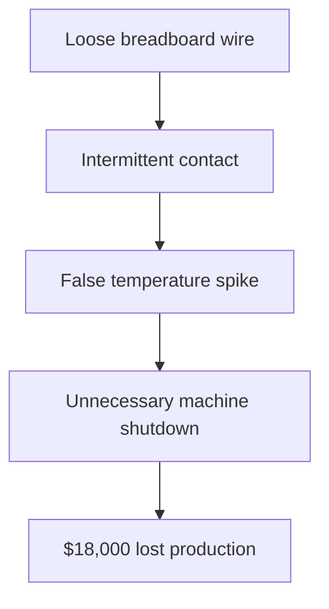
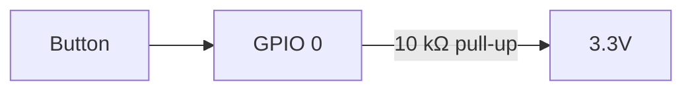

### Session 1: Electronics Fundamentals & Breadboarding Safety

**Week:** 1 **Element:** ICTIOT502 1.1–1.3, ICTIOT503 1.1 **Duration:** 3.5 hours **Phase:** Physical Computing Foundations

---

#### Session Introduction

Welcome to the first hands-on session of the Industrial IoT course.  
At AstroFab we are retrofitting 15-year-old CNC machines and conveyor systems with modern predictive-maintenance sensors. Before any sensor can be trusted in a factory environment, we must build rock-solid, safe, repeatable wiring — this starts with understanding basic electronics and breadboarding.

Today you will build your first circuit that will eventually become part of your “IoT House” factory module.

#### Learning Objectives

By the end of this session, you will be able to:
- Correctly identify and use voltage, current, and resistance in real circuits
- Safely wire LEDs and resistors on a solderless breadboard
- Use a multimeter to verify connections and measure voltage drop
- Produce portfolio evidence showing safe, labelled wiring suitable for an industrial environment
- Explain why these practices matter at AstroFab

---

#### Session Structure

1. **Theory Reinforcement** – Quick recap of core electrical concepts  
2. **Hands-on Wiring** – Build three progressively complex circuits  
3. **Live Demonstration** – Common failures and how to diagnose them  
4. **Portfolio Task** – Photograph and reflect on your first safe circuit  
5. **AWS Bridge** – Start the first Skill Builder course (homework)

---

!!! tip "Pre-Session Preparation"
	- Read the PhysComp chapter: [Electronics Fundamentals](https://makeabilitylab.github.io/physcomp/electronics/)
	- Have your Keyestudio ESP32 kit, breadboard, jumper wires, and 220 Ω / 10 kΩ resistors ready
	- Install Thonny (MicroPython) or Arduino IDE

---

#### AstroFab Context – Why This Matters

A single loose wire on a factory floor can cause:
- $25,000 unplanned downtime
- Safety incidents (sparks, overheating)
- False sensor readings → missed bearing failures

Your wiring today must be **factory-floor ready** from day one.



---

#### Required Reading (PhysComp – open in new tab)

[Electronics Fundamentals – Full Chapter](https://makeabilitylab.github.io/physcomp/electronics/)

Focus only on these sections today:
- Voltage, Current, Resistance
- Ohm’s Law & Power
- Breadboard anatomy
- LEDs and current-limiting resistors

---

#### Hands-on Tasks – Build These Three Circuits

**Task 1 – Simple LED (3.3 V rail)**


**Task 2 – Add a button (digital input)**


**Task 3 – On-board LED blink (no external LED needed)**
```python
from machine import Pin
import time

led = Pin(2, Pin.OUT)    # Most ESP32 boards have LED on GPIO2

while True:
    led.value(1)
    time.sleep(0.5)
    led.value(0)
    time.sleep(0.5)
```

---

#### Live Demonstration (Instructor)

- What a missing current-limiting resistor does (LED instantly dies)
- How to use multimeter continuity mode to find breadboard faults
- Why we never use the 5 V pin for sensors at AstroFab

---

#### Portfolio Task – Assessment 1 Evidence (submit this week)

You must submit the following to GitHub and Blackboard:

1. **Three clear, well-lit photos** (one per task above) with:
   - Your student ID visible in shot
   - All wires labelled (use small sticky labels or digital annotation)
2. **Multimeter screenshot/photo** showing ~1.8–2.0 V across the LED
3. **One-paragraph reflection** answering:
   > “Explain how the practices you used today (resistor selection, labelled wiring, multimeter verification) reduce risk in an industrial environment like AstroFab.”

This directly evidences ICTIOT502 1.1–1.3 and ICTIOT503 1.1.

---

#### Check Your Knowledge

!!! question "Q1 – Current limiting"
	Why do we use a 220 Ω resistor with an LED on 3.3 V instead of connecting it directly?
	??? tip "Answer"
		Without the resistor, current would exceed 300 mA → LED overheats and fails instantly.

!!! question "Q2 – Breadboard rails"
	What is the most common reason a circuit “works sometimes” on a breadboard?
	??? tip "Answer"
		Jumper wire not fully inserted → intermittent contact (exactly what kills factory sensors).

!!! question "Q3 – Factory safety"
	Name one AstroFab rule that comes from today’s session.
	??? tip "Answer"
		All wiring must be labelled and verified with a multimeter before deployment.

---

#### Homework – Start AWS Foundations (do this week)

Enrol and complete the first course (35 min):  
[AWS IoT Learning Plan: Foundations – Getting Started with AWS IoT](https://explore.skillbuilder.aws/learn/course/external/view/elearning/12125/getting-started-with-aws-iot)

Take a screenshot of the completion certificate — you’ll need it for Assessment 2.

---

**Navigation:** This is Week 1 | [Learning Plan](../../overview.md) | Week 2 →
```