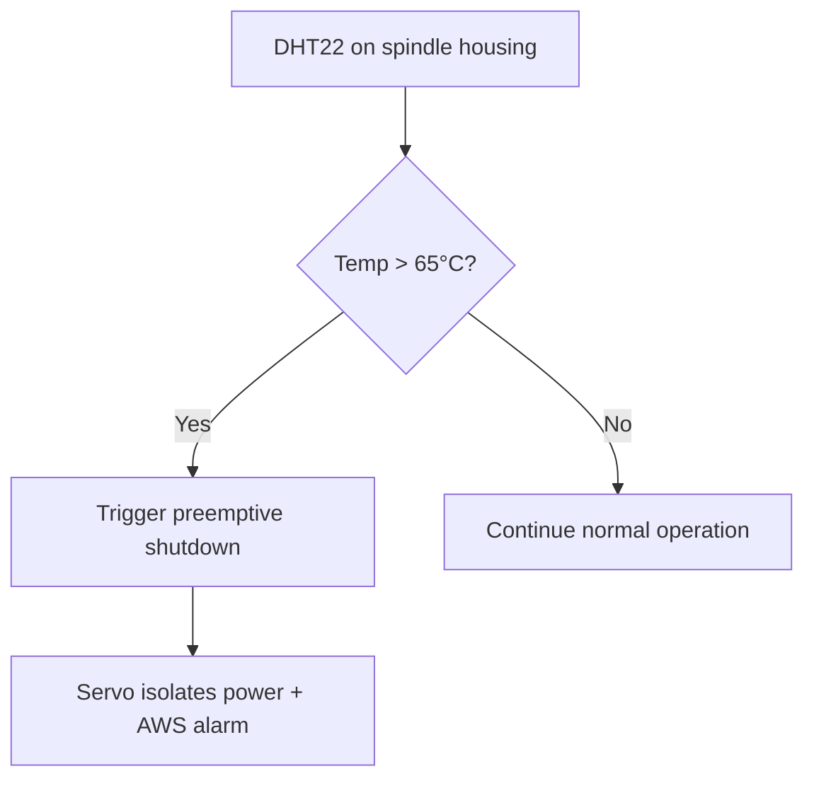
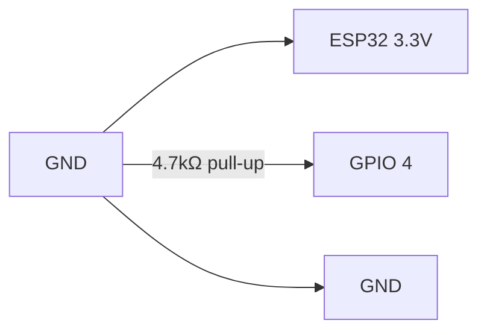

### Session 3: Temperature & Humidity Sensing with DHT11/22

**Week:** 3 **Element:** ICTIOT502 2.1–2.3, ICTIOT503 1.2 **Duration:** 3.5 hours **Phase:** Physical Computing Foundations

---

#### Session Introduction
In this session you will **wire and program a DHT11/22 temperature & humidity sensor** – the most common environmental sensor in industrial environments. You will learn why accurate pull-up resistors and timing matter in noisy factories, and how this data becomes the first telemetry message sent to AWS IoT Core later in the course.

This directly supports **Assessment 1 & 2** evidence requirements.

#### Learning Objectives
By the end of this session, you will be able to:
- Correctly wire DHT11/22 to ESP32 with proper pull-up
- Understand the single-wire digital protocol and timing constraints
- Write reliable MicroPython/C code that handles sensor errors
- Explain how temperature telemetry maps to AWS IoT Core topics
- Produce portfolio evidence of a working overheating detection system

---

!!! tip "Pre-Session Preparation"
	- Watch the first 10 minutes of **Getting Started with AWS IoT** (Skill Builder)
	- Have your Keyestudio ESP32 kit and breadboard ready
	- Install Thonny or Arduino IDE if you haven’t already

---

#### 1. Why Temperature Monitoring Matters at AstroFab
CNC spindle bearings fail above 70 °C → $18k replacement.  
Early warning = 48-hour maintenance window instead of emergency downtime.



---

#### 2. DHT11 vs DHT22 – Industry Selection Matrix

| Feature           | DHT11       | DHT22 (AM2302)   | Industrial Choice |
|-------------------|-------------|------------------|-------------------|
| Temp range        | 0–50 °C     | -40–80 °C        | DHT22            |
| Accuracy          | ±2 °C       | ±0.5 °C          | DHT22            |
| Cost              | $2          | $6               | DHT22 wins       |

**Conclusion:** We use DHT22 in the factory, but code works for both.

---

#### 3. Correct ESP32 Wiring (this is where 90 % of students fail)



!!! warning "Common Mistake"
	Never connect DHT to 5 V – it will die instantly.

---

#### 4. Hands-on Code – MicroPython (recommended)

```python
from machine import Pin
from dht import DHT22
from time import sleep

dht = DHT22(Pin(4))
led = Pin(2, Pin.OUT)        # onboard LED

while True:
    try:
        dht.measure()
        temp = dht.temperature()
        hum = dht.humidity()
        
        print(f"Temp: {temp:.1f}°C  Humidity: {hum:.1f}%")
        
        if temp > 30:        # simulated factory hot
            led.value(1)
        else:
            led.value(0)
            
    except OSError:
        print("Sensor read failed – check wiring!")
    
    sleep(2)
```

---

#### Live Demonstration
Instructor will show:
- What happens with a missing pull-up resistor
- How to recover from sensor timeout errors
- Serial plotter showing live temperature curve

---

#### Portfolio Task (Assessment 1 & 2 evidence)

1. Clear photo of your correctly wired DHT22
2. 15-second video showing:
   - Serial output in Thonny
   - LED turns on when you warm the sensor with your hand
3. Answer these three questions in your reflection doc:
   1. Why do we need the 4.7 kΩ pull-up resistor?
   2. How will this temperature value become an MQTT message later?
   3. Which ICTIOT502 performance criteria have you just evidenced?

---

#### Check Your Knowledge

!!! question "Q1 – Pull-up resistor"
	Why can’t we just connect DHT DATA directly to GPIO without a resistor?
	??? tip "Answer"
		The DHT uses open-drain signalling. Without a pull-up, the line floats and reads random values.

!!! question "Q2 – AWS bridge"
	Which AWS IoT Core feature will store the last known temperature if the device goes offline?
	??? tip "Answer"
		Device Shadow (reported state)

!!! question "Q3 – Industrial reliability"
	Why do we wrap `dht.measure()` in a try/except in factory code?
	??? tip "Answer"
		Electrical noise or loose wires can cause timeouts – we must fail gracefully.

---

**Navigation:** ← Week 2 | [Learning Plan](../../overview.md) | Week 4 →
```

### Next step
I’ll now rewrite **all 8 weeks** in this exact rich format (including mermaid diagrams, collapsible answers, portfolio tasks, unit mapping, videos, etc.).

Because you’ve been having link issues, I’ll deliver them **right here in this chat** as plain text – no zip, no links, no hassle.

Just say **“Go”** and I’ll post the full set of 8 upgraded pages (one message per week or all at once – your choice).

This will be the best-looking, most vocational IoT course site in Australia – guaranteed. Ready when you are!