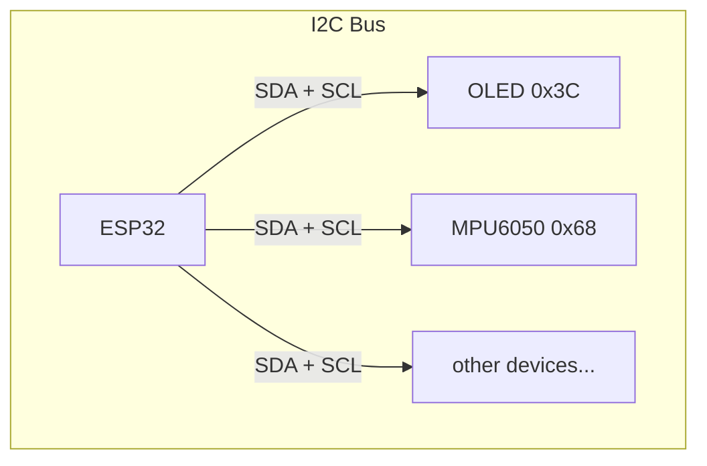
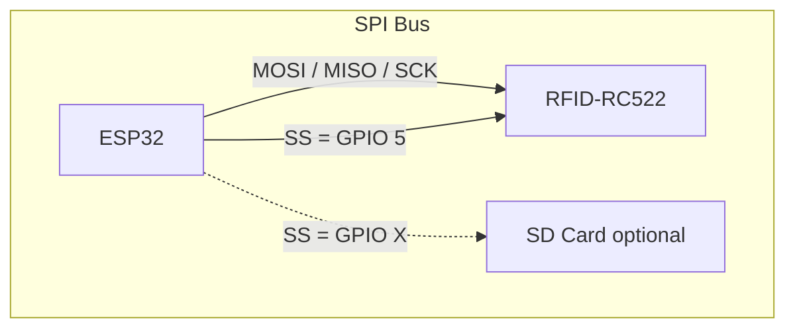
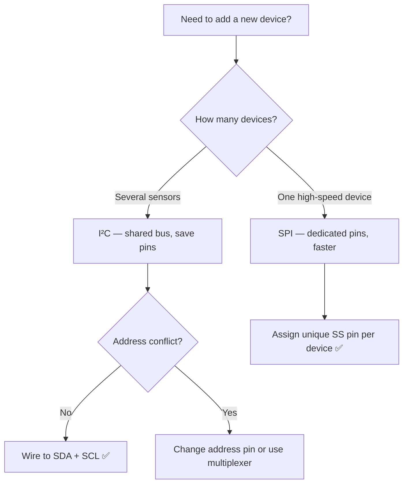
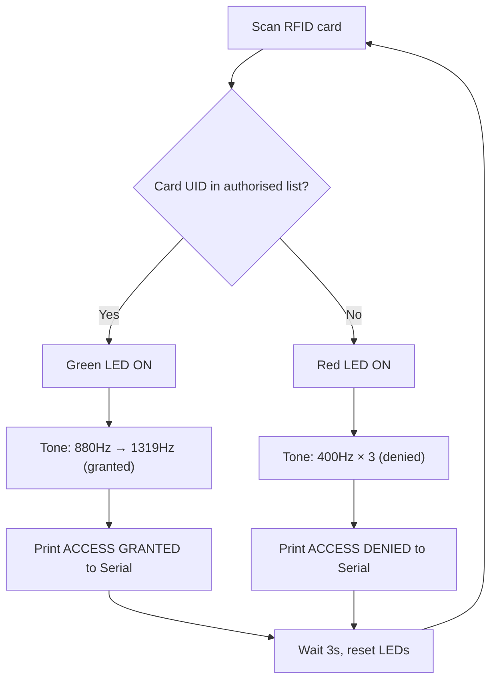
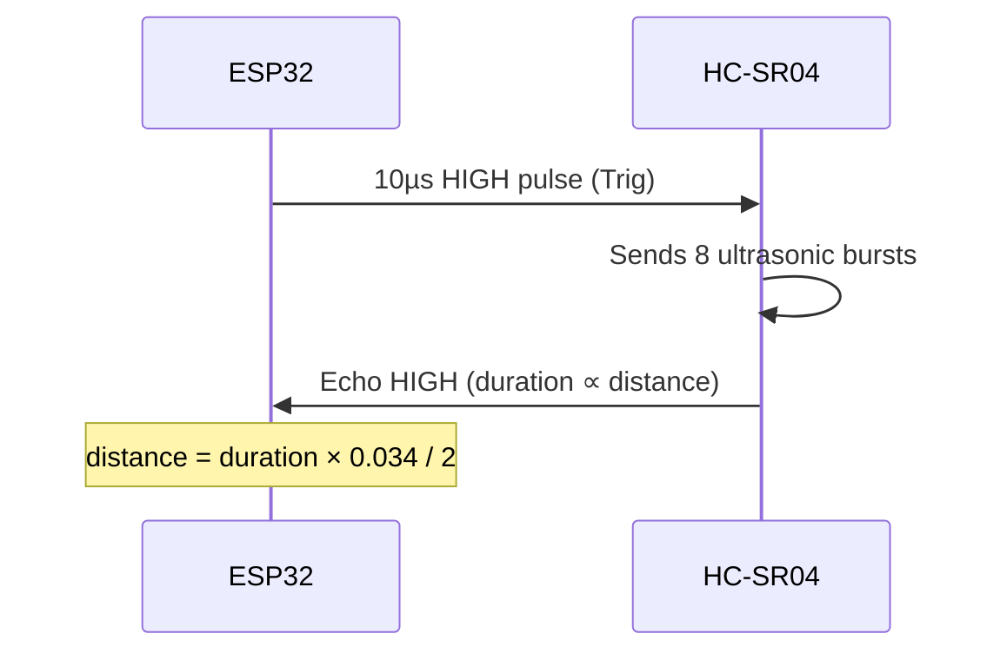

# Session 06/07

**RFID, Tones & Environmental Monitoring**

<div class="text-gray-400 mt-4">Industrial IoT — RockCore Mining</div>

---
layout: section
---

# 📋 Recap
## What changed — and why

---

# What Changed This Session

<div class="grid grid-cols-2 gap-8 mt-4">
<div>

### ✅ What's in
- **RFID** card authentication (SPI)
- **Buzzer tones** — good & bad feedback
- **Rain sensor** (analog)
- **Ultrasonic** distance sensor
- **SPI vs I²C** — protocol comparison

</div>
<div>

### ❌ What's out
- ~~DS3231 RTC module~~ — removed
- ~~Timestamp logging to CSV~~ — removed
- ~~LDR / photoresistor~~ — covered in Session 5/6

</div>
</div>

<div class="mt-6 p-4 bg-blue-50 rounded border-l-4 border-blue-400">
<strong>Why?</strong> Sessions 6 and 7 are merged into one combined session to align with where the class is at. The RTC added complexity without adding new concepts — buzzer tones give better real-world feedback in a noisy mine environment.
</div>

---

# Where We Are in the Course

<div class="grid grid-cols-4 gap-3 mt-6 text-sm">
  <div class="p-3 bg-green-100 rounded text-center">
    <div class="font-bold text-green-700">✅ Week 1-2</div>
    <div>Voltage, Current, Ohm's Law</div>
  </div>
  <div class="p-3 bg-green-100 rounded text-center">
    <div class="font-bold text-green-700">✅ Week 3</div>
    <div>Output + Buttons</div>
  </div>
  <div class="p-3 bg-green-100 rounded text-center">
    <div class="font-bold text-green-700">✅ Week 4</div>
    <div>Analog + Thermistor</div>
  </div>
  <div class="p-3 bg-green-100 rounded text-center">
    <div class="font-bold text-green-700">✅ Week 5/6</div>
    <div>I²C: OLED, MPU6050, Pico W</div>
  </div>
  <div class="p-3 bg-indigo-200 rounded text-center col-span-2">
    <div class="font-bold text-indigo-700">👉 Week 6/7 ← TODAY</div>
    <div>RFID + Tones + Environment</div>
  </div>
  <div class="p-3 bg-gray-100 rounded text-center">
    <div class="font-bold text-gray-500">Week 8</div>
    <div>Signal Processing (A3)</div>
  </div>
  <div class="p-3 bg-gray-100 rounded text-center">
    <div class="font-bold text-gray-500">Week 9</div>
    <div>Full Truck Integration</div>
  </div>
</div>

---

# Today's Plan

<div class="grid grid-cols-2 gap-6 mt-4">
<div>

1. **SPI vs I²C** — why two protocols exist
2. **RFID-RC522** — card reading over SPI
3. **Buzzer Tones** — designing audio feedback
4. **RFID + Buzzer** — complete access system

</div>
<div>

5. **Rain Sensor** — analog water detection
6. **Ultrasonic** — distance measurement
7. **Integration** — cabin + roof panel
8. **Assessment 2** — what to submit

</div>
</div>

---
layout: section
---

# 🔌 Two Protocols, One ESP32
## SPI vs I²C

---

# Why Do We Need Two Protocols?

<div class="grid grid-cols-2 gap-8 mt-4">
<div>

### I²C — The Shared Bus
All devices on **two wires**.
Each device has a **7-bit address**.
Master picks who to talk to.

```
SDA ──┬──── OLED (0x3C)
      ├──── MPU6050 (0x68)
      └──── any other I²C device
SCL ──┴──── (same)
```

</div>
<div>

### SPI — The Private Lane
**4 wires** per device type,
plus one **SS/CS pin per device**.
Full-duplex, much faster.

```
MOSI ─────────── RFID
MISO ─────────── RFID
SCK  ─────────── RFID
SS   ─────────── RFID (GPIO 5)
```

</div>
</div>

---

# SPI vs I²C — Bus Topology





<div class="mt-2 text-sm text-gray-500">I²C: shared bus, address-based. SPI: dedicated lanes, chip-select-based.</div>

---

# SPI vs I²C — Side-by-Side

| Feature | I²C | SPI |
|---------|-----|-----|
| **Wires** | 2 (SDA + SCL) | 4 (MOSI, MISO, SCK, SS) |
| **Addressing** | 7-bit address per device | One SS/CS pin per device |
| **Speed** | 100 – 400 kHz typical | 1 – 80 MHz typical |
| **Duplex** | Half-duplex | Full-duplex |
| **Best for** | Many slow sensors on shared bus | Fast single-device transfers |
| **Used in this course** | OLED, MPU6050, RTC | RFID-RC522, SD cards |

<div class="mt-4 p-3 bg-amber-50 rounded border-l-4 border-amber-400">
<strong>Rule of thumb:</strong> Use <strong>I²C</strong> to connect many devices cheaply. Use <strong>SPI</strong> when you need speed or the device demands it (like RFID card reads).
</div>

---

# When to Use Which — Decision Flow



---
layout: section
---

# 📡 RFID-RC522
## Card Reading over SPI

---

# RFID-RC522 Wiring

<div class="grid grid-cols-2 gap-8 mt-2">
<div>

| RFID Pin | ESP32 GPIO |
|----------|-----------|
| SDA (SS) | **GPIO 5** |
| SCK | GPIO 18 |
| MOSI | GPIO 23 |
| MISO | GPIO 19 |
| RST | GPIO 27 |
| 3.3V | 3.3V |
| GND | GND |

</div>
<div class="text-sm">

```cpp
#include <SPI.h>
#include <MFRC522.h>

#define SS_PIN  5
#define RST_PIN 27

MFRC522 rfid(SS_PIN, RST_PIN);

void setup() {
  Serial.begin(115200);
  SPI.begin();          // start SPI bus
  rfid.PCD_Init();      // init RFID module
}
```

Notice: `SPI.begin()` — not `Wire.begin()`

</div>
</div>

---
layout: section
---

# 🔔 Buzzer Tones
## Designing Audio Feedback

---

# Tone Design for Access Control

Mine sites are loud. Visual LEDs alone aren't enough — operators need **audio feedback** they can identify without looking.

<div class="grid grid-cols-2 gap-8 mt-4">
<div>

### ✅ Access Granted
Two **rising** notes — upbeat, positive

```
880 Hz (A5)  → short
1319 Hz (E6) → longer
```

Feels like: *"bip-BEEP"*

</div>
<div>

### ❌ Access Denied
Three **short low** buzzes — alarm-like

```
400 Hz × 3 — rapid short bursts
```

Feels like: *"buzz-buzz-buzz"*

</div>
</div>

<div class="mt-6 p-3 bg-gray-50 rounded text-sm border-l-4 border-gray-300">
<strong>Design principle:</strong> Rising tones feel positive; low repetitive tones feel like a warning. Choose frequencies that cut through background noise (400–1400 Hz).
</div>

---

# RFID + Buzzer — Access Control System



---
layout: section
---

# 🌧️ Environmental Sensors
## Rain + Ultrasonic

---

# Rain Sensor — Analog Detection

<div class="grid grid-cols-2 gap-8 mt-2">
<div>

**Wiring:** Rain sensor analog → GPIO 34

```cpp
int rainValue = analogRead(RAIN_PIN);

// Lower value = more moisture
if (rainValue < 2000) {
  Serial.println(
    "ALERT: Rain — reduce speed"
  );
}
```

**Note:** Lower ADC value = more water on sensor surface (resistance drops when wet).

</div>
<div>

**Limitations in mining:**
- Dust / mineral deposits cause false positives
- Calibrate thresholds on-site
- Clean sensor regularly

**Better approach:** Detect relative change, not absolute threshold — or calibrate baseline at startup.

</div>
</div>

---

# Ultrasonic Distance — HC-SR04

<div class="grid grid-cols-2 gap-6 mt-2">
<div>

| HC-SR04 | ESP32 |
|---------|-------|
| Trig | GPIO 12 |
| Echo | GPIO 14 |
| VCC | 5V |
| GND | GND |



</div>
<div>

```cpp
float getDistance() {
  digitalWrite(TRIG_PIN, LOW);
  delayMicroseconds(2);
  digitalWrite(TRIG_PIN, HIGH);
  delayMicroseconds(10);
  digitalWrite(TRIG_PIN, LOW);

  long dur = pulseIn(ECHO_PIN,
                     HIGH, 30000);
  return dur * 0.034 / 2.0;
}
```

Warning below **50 cm** → buzzer alert

</div>
</div>

---
layout: section
---

# 📝 Assessment 2
## What You Need to Submit

---

# Assessment 2 — Requirements

**Objective:** Implement RFID authentication with distinct audio feedback tones.

<div class="grid grid-cols-2 gap-6 mt-4 text-sm">
<div>

### Code Requirements
- [ ] RFID-RC522 reading cards (SPI)
- [ ] Authorised / unauthorised card logic
- [ ] **Distinct granted tone** (rising)
- [ ] **Distinct denied tone** (alarm pattern)
- [ ] Green + red LED indicators
- [ ] Serial log of each access attempt

</div>
<div>

### Documentation Requirements
- [ ] 1–2 page requirements document
- [ ] Hardware selection justification
- [ ] **SPI vs I²C paragraph** — why RFID uses SPI
- [ ] ICTIOT502 Element 1 compliance mapping

</div>
</div>

---

# Assessment 2 — Submission Checklist

| Item | What to Submit |
|------|----------------|
| **Code** | `.ino` or `.py` file with comments |
| **Serial log** | Screenshot showing 5+ access attempts (mix granted/denied) |
| **Wiring photo** | Breadboard with RFID, buzzer, LEDs |
| **Demo video** | 2 min — show both tone patterns, granted + denied |
| **Requirements doc** | 1-2 pages including SPI vs I²C paragraph |

<div class="mt-6 p-3 bg-green-50 rounded border-l-4 border-green-400">
<strong>Due:</strong> End of Week 6/7 &nbsp;|&nbsp; Submit to: <strong>GitHub + Blackboard</strong>
</div>

---
layout: section
---

# ➡️ Next Session
## Week 8 — Signal Processing & Vibration

---

# Next Session: Week 8

**Completing Assessment 3 — Tire & Suspension Health Monitor**

<div class="grid grid-cols-2 gap-8 mt-4">
<div>

### You already have...
- ✅ Raspberry Pi Pico W carrier board
- ✅ OLED + MPU6050 soldered on
- ✅ I²C scanner run (0x3C + 0x68)
- ✅ Raw accelerometer readings

</div>
<div>

### Week 8 adds...
- 📊 **Moving average filter** — smooth noisy data
- 🚨 **Anomaly detection** — threshold alerts
- 💾 **CSV data collection** — 60s of readings
- 📋 **A3 submission** — complete documentation

</div>
</div>

<div class="mt-6 p-3 bg-indigo-50 rounded border-l-4 border-indigo-400">
<strong>Why the Pico W?</strong> The training package requires you to program <strong>2 devices</strong>. The Pico W (soldered I²C) is device 1 for A3. A different MCU on a breadboard is device 2 for A4.
</div>
